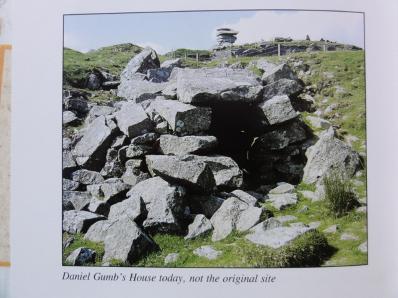
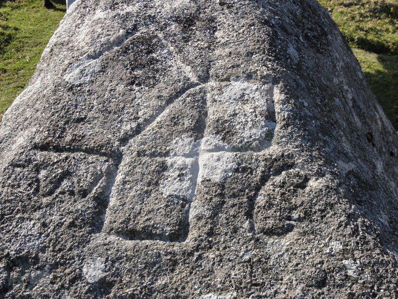
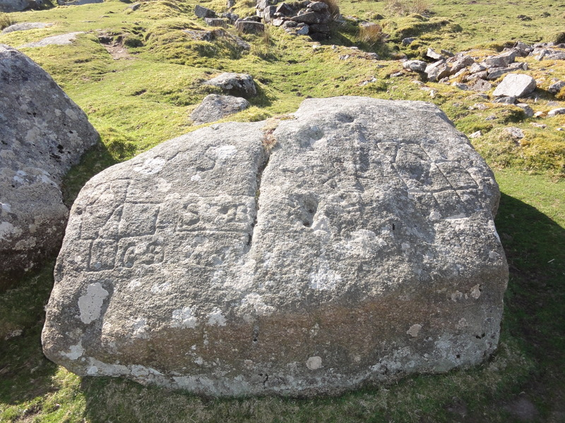

Daniel Gumb was the most celebrated character to live on the moors near Pensilva. He is best known for his home among the rocks at the Cheeswring, which in Daniel's day was a very remote place indeed. He was born in the parish of Linkinhorne on 14th April 1703 and his main occupation of stone-cutter brought him to the Cheeswring hill where he built his 'house'. He found a slightly sloping large block of granite which measured 10 metres by 3 metres which he made the roof by excavating beneath it, lining the sides with stone cemented with lime.

Daniel lived here rent free with his wife Florence Brokinshaw in 1743. They had a large family but sadly many of their children died young. Daniel had been married previously to Thomazine Roberts in 1735. Thomazine died, possibly in childbirth, but she probably lived with Daniel in his 'house' on the moor because a stone carved 'D. Gumb 1735' was found near the site of the 'house'.

Daniel used the roof of his 'house' as an observatory from where he observed the movements of the stars at night. On the surface of the rock he carved mathematical diagrams, one of which survives. He gained a reputation as a 'Mountain Philosopher' and received a number of distinguished visitors, such as William Cookworthy who was the discoverer of china clay.

Daniel died in 1776, his son John continued his father's trade of stone-cutting but found himself a more comfortable house elsewhere and abandoned 'Gumb's House'. By 1851 two John Gumbs (grandson and great grandson?) were copper miners living in Henwood.

A very fine slate tombstone can be found placed against the east wall of St Melor's church in Linkinhorne. The tombstone dates from around 1744 and at the foot is the inscription 'Cut by Daniel Gumb'

Acknowledgement: 'The Minions Moor' by Peter Stanier
