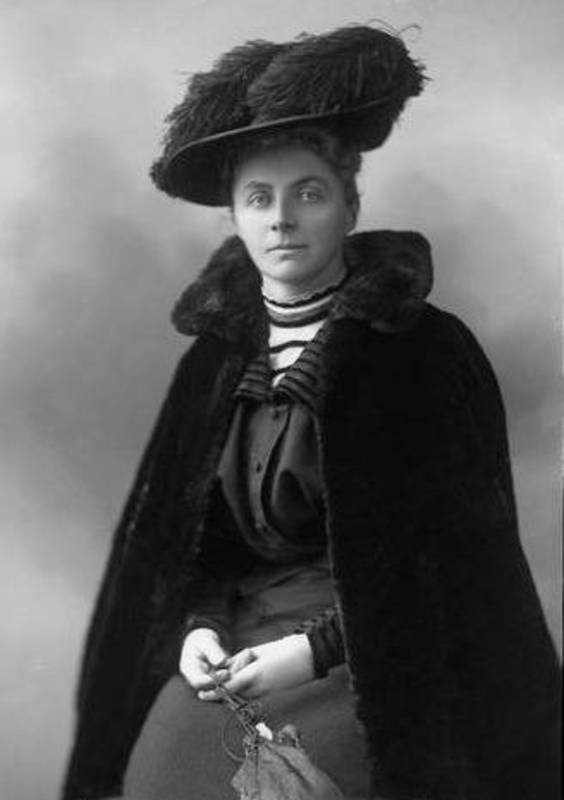
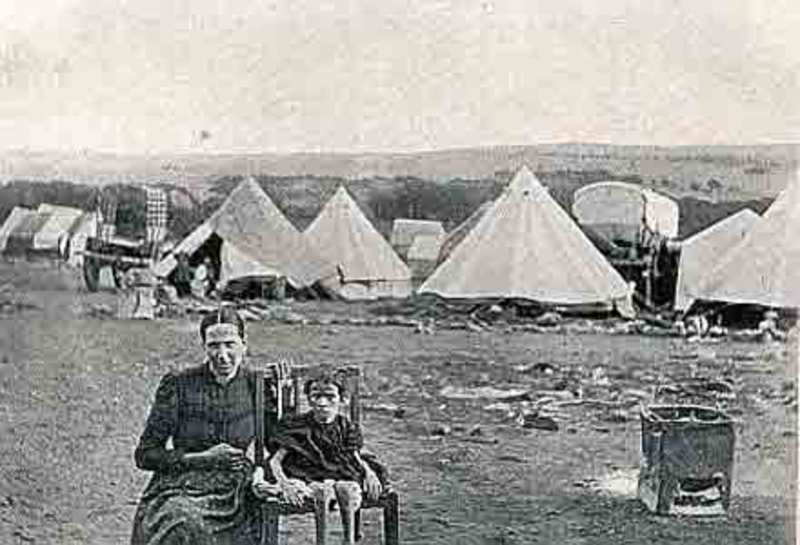
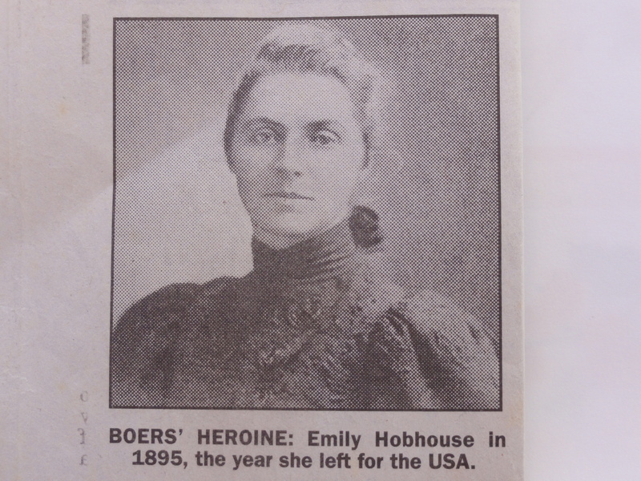
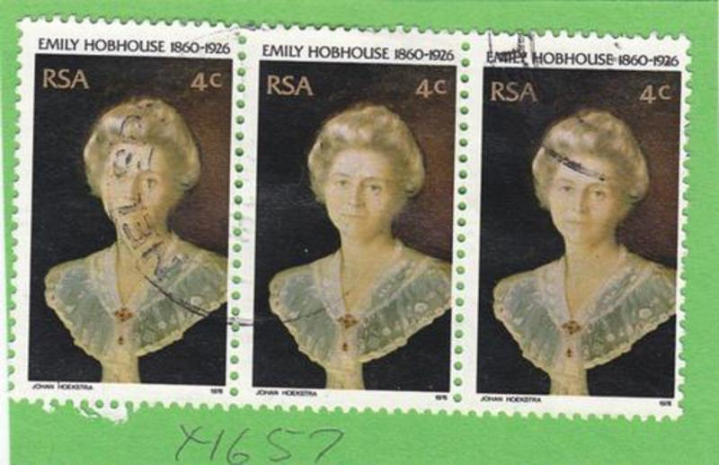

The following article, written by J.S. Wenmoth, appeared in the Parish Pump some twenty or so years ago.

#### "A prophet is not without honour save in his own country".

As was often the case, people born in a Rectory had a better chance of carving a name in history than others whom poverty and toil was their lot. Emily Hobhouse certainly had advantages in being born at St. Ive Rectory in 1860.

When Reginald Hobhouse, a bachelor and member of a well established Somerset family, came to St. Ive in 1844 he was inducted as rector. After seven years of celibacy he married Miss Caroline Trelawny, the daughter of Sir William of Harewood House, Calstock and proceeded to build a new rectory. Six children were born to them of whom Emily was the fifth. Mother died in 1880 and as other members of the family were moving out, it seemed to be her lot to stay with her father until his death in 1895, when he had completed fifty years as Rector, many of them as Archdeacon.

At thirty six she had no home, was not qualified to earn her living in a modern sense, and not wishing to live her life with well meaning relatives she left St. Ive never to return.

She offered herself to the Church for mission work and went to Minnesota, a mining town with numerous saloons, gambling dens and houses of ill-repute. Appalled by the Church's lack of concern she succeeded in establishing a Reading Room and formed a Temperance Society, urging people to sign the pledge and paid for a tribute to the Methodist mine captains who were the most sober section of the community.

The head of a chain-store was a certain T.C. Jackson who seemed competent and prosperous and became the Mayor. Friendship with him led to an engagement and Emily's thoughts seemed to be moving toward setting up a home in Mexico, where she spent quite a sum of money. After becoming Mayor, this T.C. Jackson suddenly sold the business, left Minnesota, as he said, to go to Mexico, but he disappeared out of her life and she left Mexico a much poorer and wiser woman.

Returning home, South Africa was the centre of talk as the Boers had laid siege to Mafeking, Ladysmith and Kimberly.
Cecil Rhodes and Joe Chamberlain were regarded as Empire builders but the feeling in some quarters, was that unjust dealing had forced the Boers to fight as there was no alternative. The Boers had gone to South Africa centuries earlier and were freedom loving people. They hoped to settle in the Transvaal. In 1880 the country was considered so poor that Britain had little interest in it, but the Boers were not given full control. Then two things happened, the discovery of valuable metal and the arrival of the Germans who claimed a colony.

Britain now tried to regain full control and held several conferences with the Boers between 1880 and 1895, but the talks were fruitless. The Boers, feeling they had been treated unjustly decided to attack and besieged the three towns. Many people in Britain were sympathetic to the Boers, and protest meetings were held up and down the country; and they felt it was British Imperialism at its worst. Such meetings were addressed by Lloyd George, Leonard Courtenay and others including our Emily. People who did not approve of the war were regarded as traitors and met with considerable abuse.

Coming to Liskeard to address a protest meeting in the Public Hall, the chair was taken by Sir Arthur Quiller Couch and the speakers included Lloyd George and Emily. However, the hall was full of youths and patriotic songs were repeatedly sung, no speeches were made, the chairman could not get a hearing and when the rougher elements in the hall rushed to the platform and started fights using chairs, the police moved in and rescued the speakers and Emily was helped out by some strong fellows from St. Ive.

For taking this line Emily lost many friends, her family no longer respected her and she was regarded as pro-Boer.

The British now sent out thousands of troops and the siege of the three towns mentioned was raised but the war had only begun.

The Boers who knew every inch of their country adopted guerrilla tactics, and with small mobile units constantly swooped on the British, causing considerable losses, and then rapidly disappeared. The British retaliated by burning down Boer homesteads. With their men fighting, the women and children were driven from their homes, and then watched as everything they had burnt to the ground.

Camps were formed, and the women and children were herded into these. Strands of barb-wire were put around an area, water if any, was an open stream. Rations were short, and conditions were too terrible to describe. Many children had only one garment, no shoes or stockings, and with the high temperatures by day and cold by night, and little protection, hundreds of children and some parents perished.

Rumours were reaching this country of the conditions but the Government always said there was no cause for concern as everything possible was being done.

Emily went to South Africa and was there from June 1900 to the following January. She made it her task to visit these camps and found the conditions atrocious. She set to work to get blankets, clothing, to improve the meagre rations, and medical supplies to alleviate the suffering. In some ways she was like Florence Nightingale in an earlier war. Altogether there were thirty two camps and she found conditions the same in all of them.

She came home to organise help and supplies, but when she went out a second time she was not allowed to land and was sent home.

Peace finally came on June 1st 1902 and when the Boer leaders came to England she went to Southampton to meet them and rode in the carriage with them to London. Some refused to come to London, but went direct to Holland, and others only stopped one day. It was said that the camps caused more Boer deaths than the fighting.

Emily knew that the aftermath of war is poverty, no work and a sense of hopelessness. Little money seemed to be forthcoming for rebuilding so she visited centres where weaving was done, learnt the trade and then went out and organised centres where young unemployed could be taught and to use their hands. This was reasonably successful and it was carried on for several years so that in 1905 there were at least a dozen centres where weaving and spinning was done.

Her exertions aggravated a heart condition and when a memorial was raised to the Boer fallen she went to South Africa to deliver a speech at the unveiling, but she was not well enough to attend. It was read at the unveiling, and is a plea for forgiveness "To harbour hate is fatal to your own self-development, it makes a flaw, for hatred like rust eats into the soul of a nation. So forgive, and rise to the full nobility of character and a broad and noble national life".

At heart she was a pacifist and she hated war, destruction and the suffering that is always associated with it. The Great War caused her quite a bit of sadness.

As her heart condition worsened, she lived in several places and death was finally a release.

On a memorial at Bloemfontein there are three names - Emily Hobhouse, [President Steyn](http://en.wikipedia.org/wiki/Martinus_Theunis_Steyn), [General de Wet](http://en.wikipedia.org/wiki/Christiaan_de_Wet).

Perhaps [General Smuts](http://en.wikipedia.org/wiki/Jan_Smuts), a life-long friend, sums up her achievement in these few words:

> We stood alone in the world, friendless among the people, the smallest nation ranged against the mightiest empire on the earth. Then one small hand, the hand of a woman was stretched out to us. At that darkest hour when our race almost seemed doomed to destruction she appeared, as an angel, as a heaven sent messenger, and strangest of all she was an Englishwoman.

_The following Article appeared in The Western Morning News on Friday 3rd June 1994_

### Cornish 'Nightingale' will be remembered

Just weeks after the rebirth of South Africa, Ambassador Kent Durr is visiting Cornwall to mark a link with one of his country's most remarkable women.

For possibly the first time in Cornwall, the new South African flag will fly over the Porthminster Hotel, St Ives. A plaque commemorating the last home of Cornish woman Emily Hobhouse will be unveiled by Mr. Durr. She was regarded as the Florence Nightingale of the Boers.

The house, now part of the hotel - the new leisure centre bar was her living room - was bought for her by the Afrikaner nation.

"It was a token of their appreciation for her humanitarian work on behalf of the Boers, especially in the overcrowded concentration camps run by the British" it was said.

"She was a tireless fundraiser for the plight of women and children, during and after this war, as well as a 'persona non grata' with the British Government.

"Emily Hobhouse was an amazing person and her life, battles with the establishment and good works are commemorated and taught in South Africa where she is considered, rightly, as a heroine and is a national figure referred to as their 'Angel of Love' to the same extent as would, say, Florence Nightingale in the United Kingdom."

Books have been written on her life as well as a documentary film 'That English Woman' but the last few years of her life in the UK are not well documented.

The importance of the gift of the house to her - and now the plaque in her memory - as a piece of the historical jigsaw is acknowledged by the attendance of the Ambassador, his wife and two historical researchers from the War Museum of the Boer Republic at Bloemfontein.

Among others attending will be Emily's niece, Hermione Hobhouse and civic leaders of St Ives.
And this links to her time in the Orange Free State.

The plaque is made of Delabole slate and designed and carved by Sarah More, a St Ives girl, now working in Bristol. Sarah recently carved a commemorative stone to Anthony Trollope in Westminster Abbey.

It has been a remarkable task to discover the exact location of Emily's home.
A researcher with the Bloemfontein War Museum in South Africa, Joan Abrahams, made enquiries of Stanley Cock, the curator of the St Ives Museum.

He spoke to an elderly resident of the town, who thought the property in question was at the Porthminster Hotel.

Enquiries by Trevor Richards. the general manager, and a search through the deeds, supplied the missing piece of the historical jigsaw puzzle. The ceremony is at 3pm.

#### 19 June 1901: The South African concentration camps

[Emily Hobhouse reports from inside the internment centres where Boer women and children face squalor and starvation](http://www.theguardian.com/theguardian/from-the-archive-blog/2011/may/19/guardian190-south-africa-concentration-camps)

### That Englishwoman

<iframe width="100%" height="720" src="//www.youtube.com/embed/FsJ7pPiMAz8?rel=0" frameborder="0" allowfullscreen></iframe>

### Bethulie's British Concentration Camp and Emily Hobhouse

<iframe width="100%" height="720" src="//www.youtube.com/embed/luhea9KauXg?rel=0" frameborder="0" allowfullscreen></iframe>

### 'n Song vir Emily

<iframe width="100%" height="720" src="//www.youtube.com/embed/rGjo2Y25M5A?rel=0" frameborder="0" allowfullscreen></iframe>

