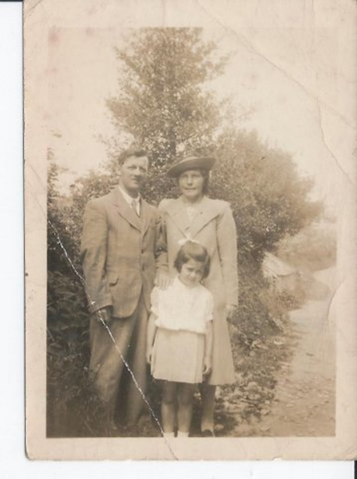
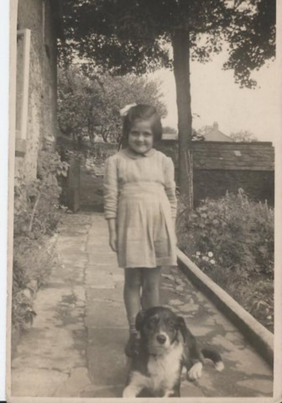
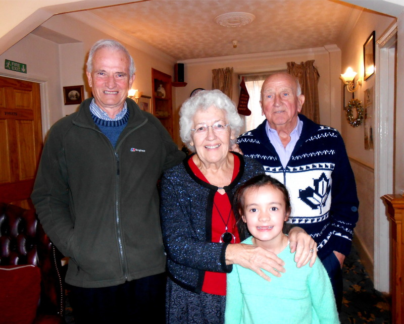

The following has been received from Mrs. Bennett who lives in Hertfordshire:-

> I was born in Pensilva in 1935 at a farm called SILVER DOWN but since it has been named Silver Dawn. My mothers family were named Davis and lived in a farm across a field from Silver Down named SPRINGFIELD. My uncle was Gideon Vincent his wife was Rhoda Davis one of my mothers six sisters. One brother named Thomas Davis who has family still living in the area. Afraid my memory cannot remember all the names of the lanes in Pensilva, but still visit them when I am down that way fairly often. After my father went to work in Devonport Dockyard we came to St Budeaux to live. Gideon and Aunt were staying with us and their daughter, uncle went off one of the days to join his ship and had not been gone long when neighbours were coming in to tell us the Courageous had been hit with a torpedo and they were bringing survivors ashore at the Naval Barracks so we rushed there and spent hours seeing a lot of sailors who were on the ship, but one my mother knew said to her I do not think Gideon will make it as he had his head badly hurt. It was so sad for all of us I was still young but it has always been stamped on my brain. I have never forgotten it. I had another Aunt and Uncle named Rich who owned the grocery shop in the main street. Also another Aunt who owned the Drapers shop, named Meta Greenaway her daughter named Phyllis who was the Carnival Queen once. I think the main street is called Princess St (Am I right?). After I married my husband Raymond I moved to Hertfordshire and had two children. Deborah and Russell. I hope this will be of some interest to you. Sincerely Marie Bennett.

Editor's Note: Marie's surname before she married was 'Richards'.

Marie's grandfather lived at 'Springfield' in Lower Middle Hill and kept a horse called 'Fly'. There is an old horseshoe above the cottage door which may have belonged to Fly. Marie has recently sent this email:

"Grandfather had a Trap for the horse and would take my mother to Saltash Waterside for a day out, they would pack the Trap with butter, cream and eggs and sell to folk at Waterside, my mother made lots of friends at Saltash and I remember her taking me as a little girl to visit some in later years. I wonder how long the journey took back then?"

