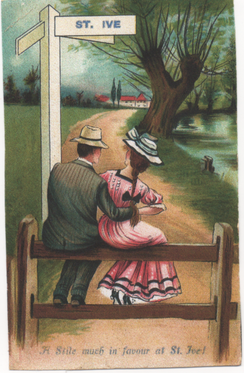

This copy of a postcard was sent to us by Susan Maunder. The postcard was sent at 6.45pm on 30th May 1908 to Susan's Grandfather, Mr. H. Kelly, Trecorme Farm, Quethiock and the postage was one halfpenny.

