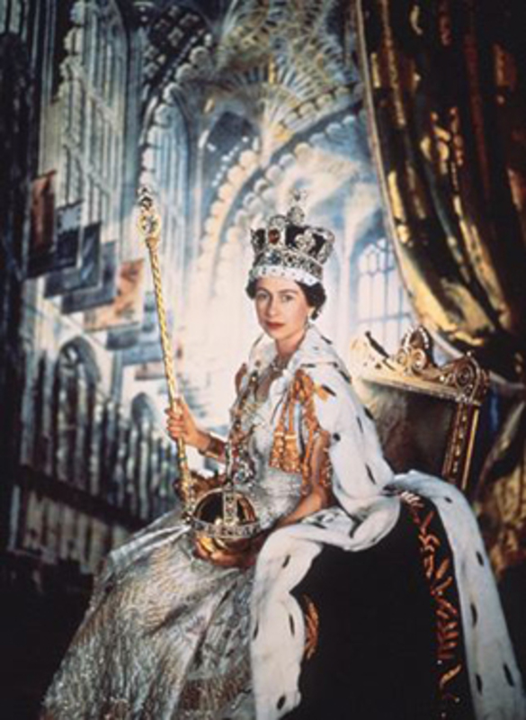
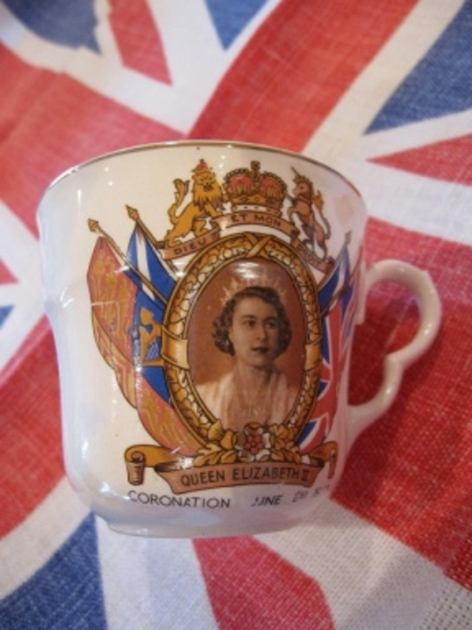

The following article has been written and researched by Sandra Pearson, Secretary of the Pensilva History Group.

From The Cornish Times June 5th 1953.

>  **TELEVISION AT PENSILVA**

> The day started with the television programme when over 80 persons gathered at Mr D. Gilbert's workshop and Mr T. Harvey's 'Lyndhurst' to watch the coronation. In the afternoon a united service in the Primary School was conducted by the Rector (Rev J.Jones) assisted by Salvation Army Officer in Charge and the Methodist representative who gave an address. A folk dancing display in the school playground by the children conducted by Miss Hancock and a free tea for schoolchildren and old folks in the school room followed.

> After tea everyone gathered in the recreation field for sports, races for the children and a cricket match between married and single men. Coronation mugs were presented to the children of school age and under, by Mr B.T. Skentelbery and a social was held in the school room with songs, games and dancing.

> A large bonfire was lit on Caradon Hill by Mr E. Hambly. This must have been witnessed by hundreds of people and seen for miles bringing Pensilva's great day to a close.

> **ST IVE**

> Peals on the church bells commenced the day's festivities with three generations of ringers taking part: Mr Thomas Barrett, his son Richard and Richard's son Tony. A Union Jack flew from the tower.

> A combined service, with the Rev J. Jones officiating, preceded a free tea for all provided at the Institute and the Methodist Sunday School, a children's fancy dress carnival with Mr and Mrs George Cranage as judges, sports for the children and a bonfire at dusk. Mr R. Mutton lent the field for the sports. The Old Time Dance Club ran a dance until midnight.
