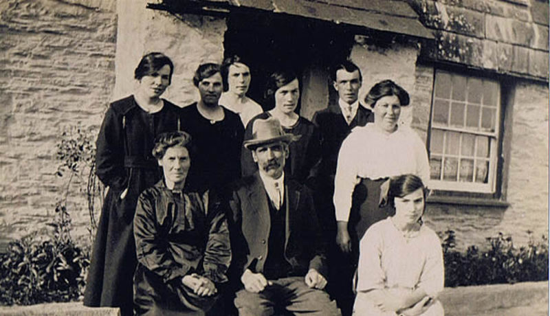
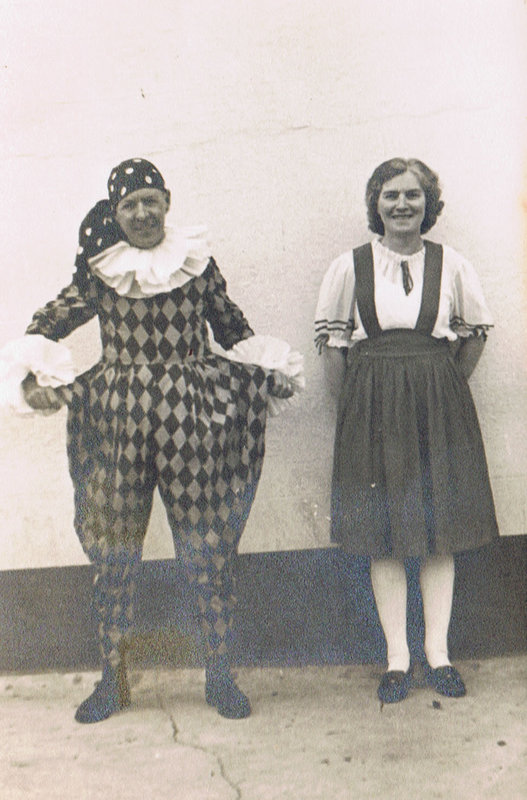
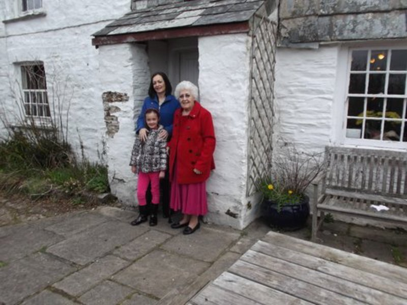

The above photograph has been kindly sent to us by Deborah Hodgson, the daughter of [Marie Bennett](/people/20-mrs-marie-bennett). The photograph shows Daniel and Emmeline Davis and their children outside their farmhouse 'Springfield' believed to be in 1922. 'Springfield' is in Lower Middle Hill in Pensilva.

Daniel and Emmeline Davis are the grandparents of Marie and the great grandparents of Deborah.

Deborah has since provided the following information:-

"The Davis family were born in the following order. All except Tom were born in Pensilva:-

Ethel,
Henry (known as Tom),
Elsie,
Hilda,
Winnifred,
Rhoda,
Meta,
Florence

My great grandmother Emiline (sometimes spelt Emlyn on her records including the gravestone) was born approx 1862 and died on 7th May 1937. Her daughter Ethel died just four days later on 11th May. Great grandfather Daniel died 11th October 1947"

