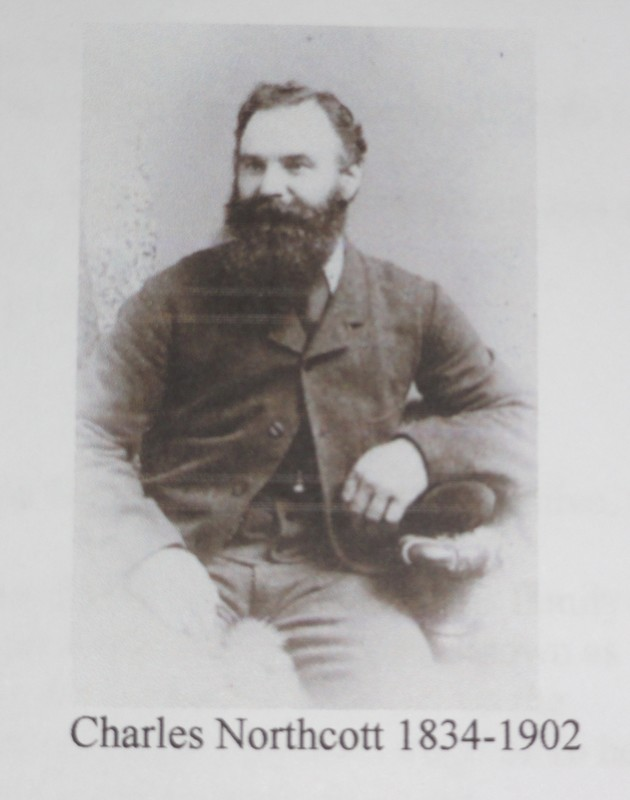
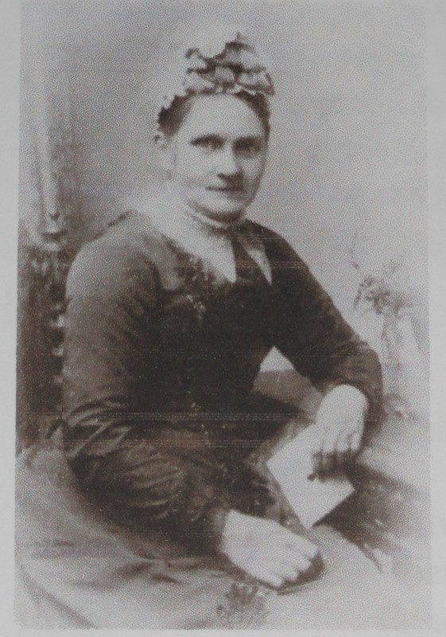
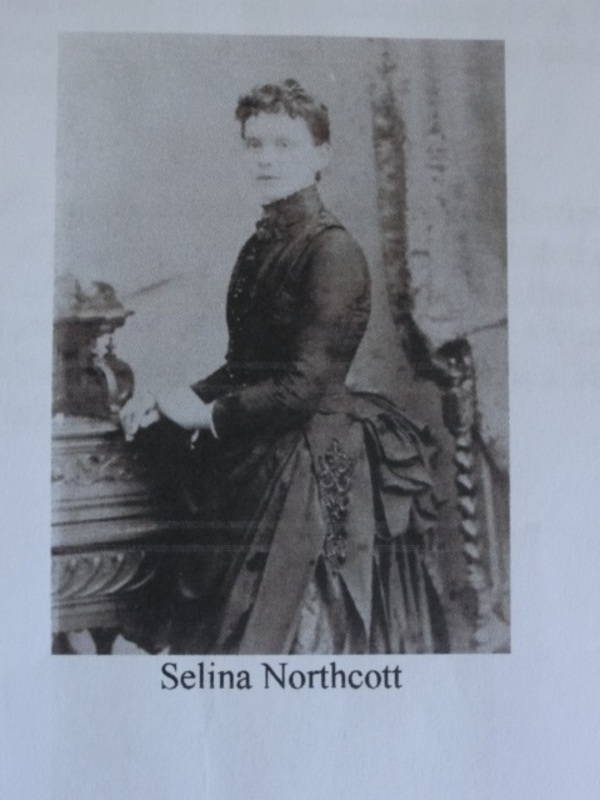
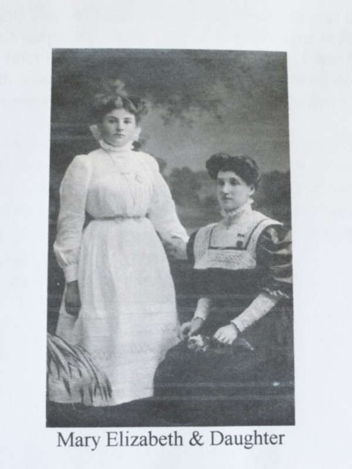
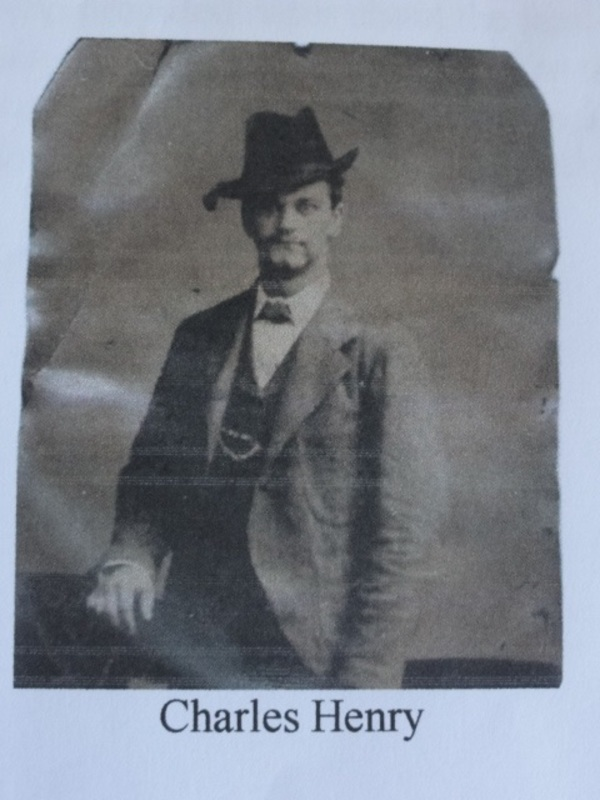
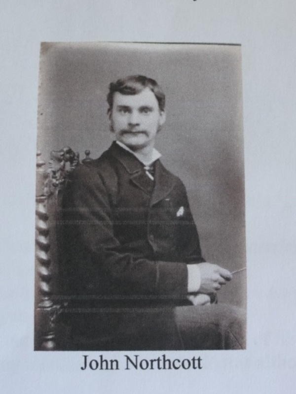
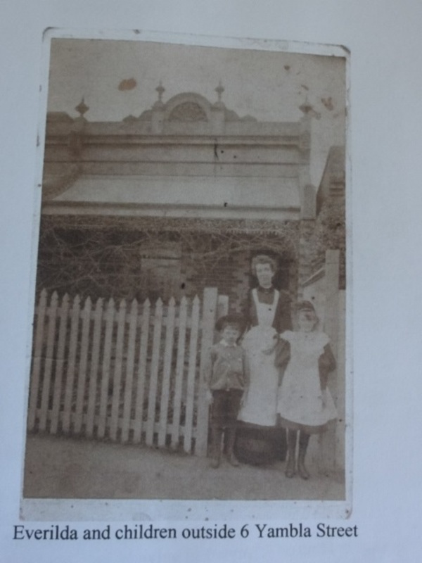

This family history has been compiled and kindly sent to Pensilva History Group by Anne Jackson of Melbourne, Australia assisted by her friend, near neighbour and relative Lyn Collins.

Family research shows the Northcott family originally came from Devon settling in Cornwall in 1720. Initially in the Lanreath and St Veep areas where they were tenant farmers through several generations.

Charles Northcott (1834-1902) was born in Pelynt village. His father Philip Northcott was born in St Veep in 1802 and died in Pelynt in 1871.
Phliip married Elizabeth Stephens and had ten children.
The 1851 census lists the Northcott family living in Pelynt. The cottage is identified in a history exhibition in the Pelynt Parish Church in a terrace opposite the church.
Philip's occupation is listed as carpenter.
Charles was one of the ten children. He married Jane Rickeard (1834-1921) in the Parish Church St Ive in 1855. They had 5 children all born in St Ive.
The 1861 census shows Charles and family living in Gang. His occupation is listed as a carpenter. His wife Jane, is 27, their children. Selina 5, Mary Elizabeth 3, Charles 1 month.
Also recorded is Thomas age 24, a carpenter, brother to Charles.
The 1871 and 1881 census shows the family living in Pensilva.
In the 1871 census all the family are present. Charles 37, occupation carpenter, Jane his wife 38, Selina 15, Mary 13, Louisa 12, Charles 10 and John 8. Also recorded are three boarders listed as apprentice carpenters. Benjamin Venning 18, Richard Kelly 22, and John Cossentine age 23. The 1881 census having more detail gives the address as Chapel Road near the intersection of Chapel Terrace and next to Rose Cottage.
Charles in this census is recorded as a builder. There are now only three children present. Mary 23, a dressmaker, Louisa 22, a scholar, and John 18 listed as a builder.

Also present on census night were 2 Rickeard guests most likely relatives of Jane one of them a Stoker in the Royal Navy from Northumberland. It is not known where Charles or either of his sons Charles or John worked.
The family were Methodists and Charles was Superintendent of the Weslyn Chapel Sunday School. Between 1882-1885 all the family except Selina, the eldest child. emigrated to Australia. Shipping records however have not been found for everyone. It is known that Mary Elizabeth and Everilda (her future sister-in-law) arrived in Melbourne on the 'Orient' in March 1885.

John and Louisa and John Richards are listed on the 'John Elder' arriving also in Melbourne in July 1884. The arrival of the rest of the family is not known but thought to be sometime between 1882-1885. The following provides some details of the children of Charles and Jane Northcott and all would have grown up and attended school in Pensilva. All five children married people from the Pensilva area.

Selina (1856-1930) the eldest daughter, married John Henry James also from Pensilva, in 1878 in Liskeard. James was born in Pensilva in 1854. The 1871 census shows him living with his family at Blakes Cottages. His father was a copper miner and a Methodist lay preacher on the Callington circuit. James chose not to follow in his fathers footsteps. At the age of 16 he was already working as a carpenter, he may well have learnt his trade from the Northcotts. After their marriage in 1878 Selina and James went to live in Hackney, London, where James became a successful builder and developer. They had 9 children. In 1891 they moved to Wood Green, London, and James began to establish his own business as a builder. He was involved in the redevelopment of the Chitts Hill Estate. The work comprised of some 200 purpose built maisonettes and sixteen terrace houses. Today there is a Northcott Avenue in Wood Green.

Mary Elizabeth (1858-1926) known within the family as "Polly", Mary Elizabeth married John Henry Temby (1856-1930) on 25th March 1885 in Melbourne, Australia two days after her arrival. He was a tailor by trade. They had 9 children 5 of whom survived into adulthood.

Louise (1859-1919) married James Richards in Australia in 1886. The 1881 census shows him living at Trewooda Farm, Pensilva. His occupation listed as builder. They had 6 children only one daughter surviving from infancy.

Charles Henry (1861-1940) was a carpenter like his father Charles. He married Harriet Jane May (1858-1951) in 1882 in Gwennap, Cornwall. He is listed in the 1881 census as living in Hackney, London at the same address as his sister Selina. Possibly working with Selina's husband. He then spent some time working in South Africa before returning to Cornwall to marry Harriet Jane and then emigrating to Australia. He specialised in the building of staircases and in his spare time built furniture.

John "Jack" (1863-1929) The 1871 and 1881 census shows he was living in Pensilva and occupation listed as a carpenter. He emigrated to Melbourne in July 1884 with his sister Louisa and a year later married Everilda Wallis (born St Cleer 1861-1941). Everilda sailed to Melbourne with Mary Elizabeth Northcott, her future sister-in-law and married John Northcott two days after their arrival at the Fitzroy Methodist Church Melbourne in March 1885.

Everilda set sail with a large trousseau for the antipodes. Amongst her possessions were two sets of crockery, a Wedgewood Jasperware coffee set, several ornaments including a figure of Robinson Crusoe under a palm tree made of tin. These remain in the family. In Australia John worked as a builder and coach builder and ran his own business. Family legend has it that as John disembarked carrying his carpentry tools in a bag he was offered a job as he came down the gangway!
Some of his carpentry tools remain in the family.

Upon setting up in Melbourne the entire Northcott family built a row of terrace houses in Yambla Street, Clifton Hill and all lived next door to each other. These Victorian style single storey terraces can still be seen today.

A descendant, Gwen Stone, who provided notes about the famliy several decades ago stated 'the Northcott family were a very close family because they all built houses next door to one another and the cousins saw a lot of each other. They also had a lot of get-togethers and big parties which they all seemed to enjoy and they would all help one another where possible.'

Lyn Collins (descendant of Charles) and Anne Jackson (descendant of John) visited Cornwall in 2015 to research family history. Their great grandfathers were brothers and both carpenters who grew up in Pensilva for several decades before emigrating to Australia. The second house that John built and lived in until the end of his life was called 'Pensilva', the name must had had many memories for him to do this although he never returned to Cornwall.
