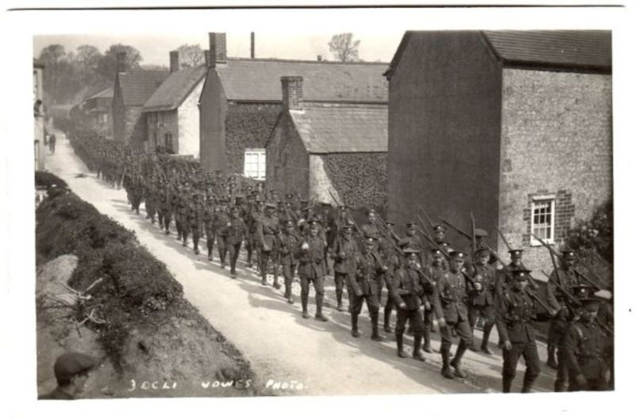
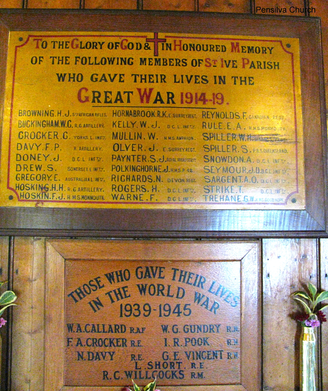
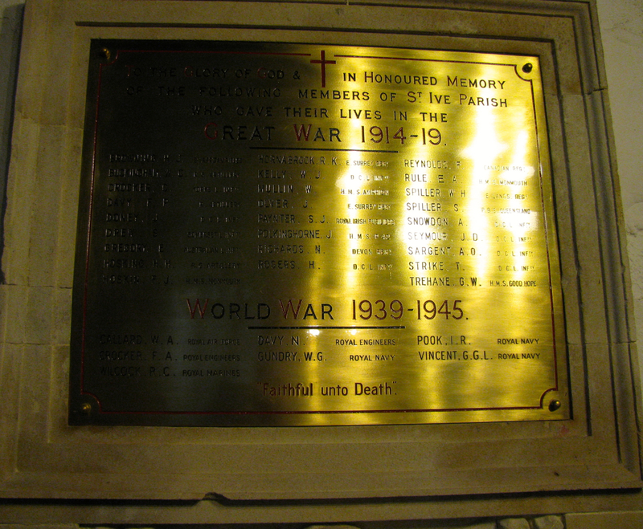
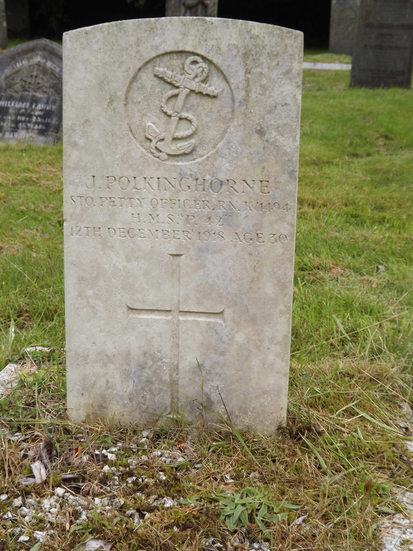
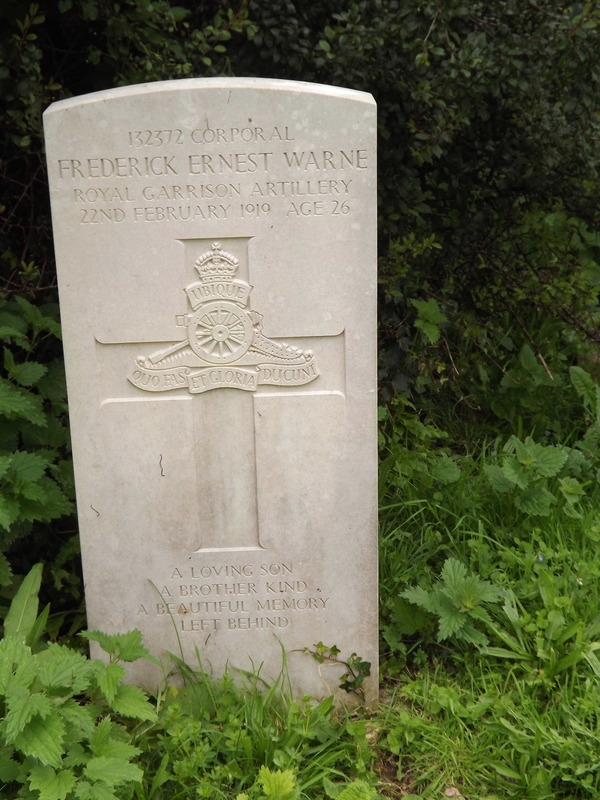

## World War One 1914 – 18

### BROWNING, Herbert John

2nd South African Rifles 491

Died 1/05/1918 Age 45

[Mangochi Town Cemetery, Malawi. Contains 60 war graves][91603]

Son of John and Louisa Browning, Pensilva

b –June ’73, Liskeard

### BUCKINGHAM, William Charles

Gunner  Royal Field Artillery 337th Bde, Ammunition Col. 128288

Died 5/11/1918

[Baghdad (North Gate) War Cemetery, Iraq. Contains 4,450 war dead][57303]

b – Mar ’85, Liskeard

Enlisted Liskeard

### CROCKER, Charles

Private, Yorkshire Regiment 3533

Died 30/10/1914 Age 25

[Ypres (Menin Gate) Memorial, Belgium. Commemorates 54,000 soldiers who have no known grave.][91800]

Son of Mrs Ellen Beer of West Warlinton, Crediton, Devon 1901 living at Great Leys, St Ive Keason, born Templeton Devon

(m – Rose Hocking March 1913)

### DAVY, Frederick Percival

Gunner Royal Field Artillery 4th Div. Ammunition Col. 86520

Died 22/03/1918 Age 30

[Faubourg D’Amiens Cemetery, Arras Contains 2,650 war dead.][28800]

Son of Emma Davy, of Turran Terrace, Pensilva, Liskeard, Cornwall, and the late Henry Davy.

b – Dec. ’87, Liskeard

### DONEY, John Garfield

Private London Regiment 1ST/7th Bat 6390

Died 15/09/1916 Killed in action Age 21

[Thiepval Memorial, Somme, France. Contains the names of 72,000 soldiers with no known grave, 90% died between July and November 1916.][80800]

Son of William and Martha Doney, of Wagmuggle, South Hill, Callington, Cornwall.

b – June ’95, Liskeard (South Hill)

Enlisted Liskeard

Formerly 24375, 9th D.C.L.I.

### DREW, Samuel

Private Somerset Light Infantry 6TH Bat 32389

Died 29/01/1917 Died of wounds Age 38

[Wanquetin Communal Cemetery Extension, Pas De Calais, France Contains 230 war dead mainly from a clearing station.][7804]

Son of William and Elizabeth Drew, of Pensilva, Liskeard, Cornwall; husband of Kate Drew, of "The Laurels," Bow St., Langport, Somerset.

b – June ’78, Liskeard

m – Kate Evans 1904, Langport

Enlisted at Castle Carey, Somerset

Formerly 27580, Devonshire Regiment

### GREGORY, Ernest

Lance Corporal Australian Infantry, A.I.F. 41st Batt.    177

Died 4/10/1917 Age 30

[Nine Elms British Cemetery, Belgium. Contains 1,500  who mainly died of their wounds.][14300]

Son of George and Christiana Gregory, of Venn Farm, St. Ives, Liskeard, Cornwall, England.

b- June’87, Liskeard

### HOSKING, Herbert Henry

Gunner Royal Garrison Artillery 142nd Siege Bty 95371

Died 9/04/1917 Died of wounds Age 36

[Aix-Noulette Communal Cemetery Extension, Pas De Calais, France Contains 750 war graves.][25500]

Son of William and Maria Hosking, of Pensilva, Liskeard, Cornwall.

b - Dec.’80, Liskeard

Enlisted at Liskeard

### HOSKIN, Emmanuel John

Petty Officer Stoker HMS Monmouth 300936

Died 1/11/1914 Age 30

[Plymouth Naval Memorial Commemorates 7,250 sailors of WW1 and 16,000 of WW2][142001]

Husband of S. M. Hoskin, of Church St. North, Liskeard, Cornwall.

Notified widow Sylvia Hoskin, Middle Hill, Pensilva

Sunk at the Battle of Coronel, off the coast of Chile.

b – 26/12/1883, Liskeard (North Woolston, St. Ive)
m - Mar ’06, Liskeard, to Silvia May

### HORNABROOK, Richard Kelly

Lance Corporal East Surrey Regiment, 7th Bn. 21142

Died 30/11/1917 Killed in action 22

[Cambrai Memorial, Louverval, Nord, France Contains names of over 7,050 war dead with no known grave who died in the Battle of Cambrai, July to November, 1917][79300]

Son of William James and Emily Hornabrook, of Alfred Rd., Farnham, Surrey.

b - Dec. ’94, Lambeth

1911 census, living at Keason St. Ive, a scholar

Enlisted at Canterbury

### KELLY, William John

Private Duke of Cornwall’s Light Infantry, 10th Btn 24857

Died 3/09/1916 Killed in action Age 23

[Euston Road Cemetery, Colincamps, Somme France Contains 1,300 war graves.][58400]

Son of Mr. and Mrs. J. Kelly, of Tokenbury, Pensilva, Liskeard, Cornwall.

b - Sep. ’93, Liskeard
m - June ’13, Liskeard to Maud Mitch

1911 census, a farm worker at Tokenbury.

Enlisted at LIskeard

### MULLEN, William

Leading Stoker HMS Amphion 307070

Died 6/08/1914

[Plymouth Naval Memorial Commemorates 7,250 sailors of WW1 and 16,000 of WW2][142001]

Notified wife Edith Mullen, Truan’s Terrace, Pensilva

Light cruiser, hit  by a mine and sank in the North Sea.

b – 20/8/86 Tavistock

### OLVER, John Hodge

Private East Surrey Regiment, 1st Bat 28531

10/10/1917 Died of wounds Age 20

[Tyne Cot Cemetery Belgium Contains 12,000 war dead. Largest war graves cemetery. Tyne Cot Memorial contains 35,000 names who have no known grave.][53300]

Son of William and Ann Olver, of Hay Ford, St. Ive, Liskeard, Cornwall.

b - Jun. ’97, Liskeard

1911 census, at school
Enlisted at Bodmin

Formerly 6814 Middx Regt.

### PAYNTER, Samuel John

Serjeant Queen Victoria’s Royal Irish Fusiliers, 5th Bn. 14925

Died 16/08/1915 Killed in action Gallipoli Age 23

[Helles Memorial,  Turkey Bears the names 0f 21,000 personnel who died around Gallipoli.][76100]

Son of Mr. J. H. Paynter and Mrs. H. Paynter, of Jubilee Farm, Pensilva, Liskeard, Cornwall.

b - Jun. ’91, Liskeard

1911 census, working in family butchers business.

Enlisted at Liskeard

Formerly 16008 D.C.L.I.

### POLKINGHORNE, James

Petty Officer Stoker, HMS “P 42” K/1492

Died 12/12/1918 Died from Disease Age 30

Pensilva Cemetery

Husband of Gladys Thomas (formerly Polkinghorne)

2 Wesley Terrace, Pensilva.
Notified wife Gladys M Polkinghorne, Princess Row, Pensilva.

b – 5/11/1888, Bere Alston, Devon
m - Sep. ’15, Liskeard to Gladys Thomas

### RICHARDS, Norman

Private Devonshire Regiment, 9th Bn. 25352

Died 25/10/1918

[Pommereuil British Cemetery, Nord, France Contains 170 War graves.][58903]

b - Mar. ’99, Liskeard

### ROGERS, Herbert

Private Duke of Cornwall’s Light Infantry, 6th Bn. 240501

Died 25/4/1918 Killed in Action

Born  in Pensilva

Son of Joseph Rogers,

1901, Lower Road, St Ive

b – 1892 St Ive Cornwall
Enlisted at Bodmin

### WARNE, Frederick Ernest,

Corporal, Royal Garrison Artillery, ‘Z’ Anti aircraft Bty. 132372

Died 22/02/1919 Age 26

Antony Cemetery, Cornwall

Son of Simon and Jessie Warne, of Torpoint.

Uncertain details

b - Mar. ’93, St Germans

1911 census, living at 10 Ferry Street, Torpoint, a grocer

### REYNOLDS, Frank

Sapper, Canadian Engineers 3rd Tunnelling Cy. 2006803

Died 8/11/1918 Age 28

[St Andre Communal Cemetery, Nord, France Contains 150 war graves.][28002]

Husband of Nellie Reynolds, of 422, North Green St., Tupelo, Miss., U.S.A. Native of Pensilva, Liskeard, England.

### RULE, Ernest Alfred

Stoker 1st Class HMS Monmouth K/1327

Died 1/11/1914 Age 24

[Plymouth Naval Memorial Commemorates 7,250 sailors of WW1 and 16,000 of WW2][142001]

Son of John Charles Rule, Wesley Terrace, Pensilva.

Notified mother, Mary J Rule, Fernleigh Cottage, Pensilva

Sunk at the Battle of Coronel, of the coast of Chile.

b – 20/08/90, Calstock

1911 census, Stoker 1st class on HMS Daring

### SPILLER, William Henry

Private The King's (Liverpool Regiment) 20th Bn. 50266

Died 19/12/1917 Killed in Action Age 39

[Railway Dugouts Burial Ground, Belgium Contains 2.500 war dead.][56000]

Son of William and Mary Spiller, of St. Ive Cross, Liskeard; husband of Mary Elizabeth Brooking (formerly Spiller), of 10, Belford St., Burnley.

b - Jun. ’80, St Germans
m - Jun. ’00, Liskeard to Mary Elizabeth Dunn

Enlisted at Burnley

### SPILLER, Sydney

Private, Australian Pioneers, 5th 1055

Died 23/04/1918 Age 26

[Longpres-les-Corps Saints British Cemetery, Somme, France Contains 78 war graves][7102]

Son of William Henry and Sarah Ann Spiller, of Butchers House, Pensilva, Liskeard, Cornwall. Native of St. Ives, Cornwall.

b – Sep.,’89, St Germans

### SNOWDON, Alfred

Private Duke of Cornwall’s Light Infantry, 10th Bn. 26546

Died 15/02/1918 Killed in Action Age 38

[Rocquigny-Equancourt Road British Cemetery, Manancourt, Somme, France Contains over 1,830 war graves.][2000081]

Son of John T. and M. A. Snowdon, of Quarry Rd., Pensilva, Liskeard, Comwall.

b – Dec. ’79, Liskeard

1911 census, living at St Ive Cross, a mason.
Enlisted at Liskeard.

### SEYMOUR,

Son of Fernands and Ellen Seymour
? b – Mar. ’77, Liskeard
1911 census, a gold miner, aged 34, living at Pensilva.

### SARGENT, Oliver Anthony

Lance Sergeant, Duke of Cornwall’s Light Infant., 2nd/4th Bn. Cps. of Milit. Acc. 2902

Died 22/09/1916 Age 33

[Basra War Cemetery Iraq Contains 2,500 war dead. Around Basra there are 45,000 war dead.][57200]

Son of the late Mr & Mrs Thos Sargent of 28 Brook St., Tavistock, husband of Ida Emily Sargent of 8 Sharbally Terrace, Torpoint, Cornwall

b – Dec. ’83, Tavistock
m – Mar. ’08, Devonport to Emily Pengelly

1911 census, Head Teacher at Pensilva Elementary School.

### STRIKE, Thomas

Private Duke of Cornwall’s Light Infant., 1st /4th Bn. 200570

Died 27/10/1917

[Kantara war Memorial Cemetery, Egypt (50kms south of Port Said) Contains 1,600 war dead.][54500]

Son of William and Catherine Strike

b – Sep. ’93, Liskeard

1911 census, a tin miner at Pensilva
Enlisted at Bodmin

### TREHANE, George 

Leading Stoker, HMS Good Hope K1240

Died 1/11/1914 Age 26

[Plymouth Naval Memorial Commemorates 7,250 sailors of WW1 and 16,000 of WW2][142001]

Son of Harry and Elizabeth Trehane, of "Byewood," Pensilva, Liskeard, Cornwall.
Notified mother as above.

Sunk at the Battle of Coronel, of the coast of Chile.

b – 30/5/1888 Pensilva.

## World War Two 1939 – 45

### CALLARD, William Andrew James

Aircraftsman 2nd Cl. RAF Volunteer Res. 1156424

Died 29/08/1940 Age 27

[Runneymede Memorial Contains the names of 20,300 airmen who have no known grave.][109600]

Son of James and Maud Callard, husband of Doris Edna, Pensilva, Cornwall

b – June ’14, Plymouth.

### CROCKER, Frederick Arthur

Sergeant, Royal Engineers,  253 Field Coy. 1873842

Died 30/05/1940 Age 21

[Dunkirk Memorial Contains the names of 4,500 who died at Dunkirk or in captivity and have no known grave.][2082800]

Son of William Henry & Lucy Crocker, Pensilva

b – June ’19, Liskeard

### DAVEY, Norman

Sapper,  Royal Engineers, 18, Field Park Coy. 2009057

Died 23/10/1944 Age 27

[Coriano Ridge War Cemetery, Italy. Contains 1,930 Commonwealth war graves.][2004100]

Son of Herbert and Bessie Davey, Liskeard

b –sep ’20 Truro

### GUNDRY, William Gerald

Petty Officer Stoker HMS Neptune D/KX 85154

Died 19/12/1941 Age 26

[Plymouth Naval Memorial Commemorates 7,250 sailors of WW1 and 16,000 of WW2][142001]

Son of Joseph and Minnie Gundry; husband of Gweneth Noreen Gundry, of Moorswater, Cornwall.

HMS Neptune sunk with the loss of 750 crew after sailing into a mine field off Tripoli and hitting at least 4 mines.

b – Dec. ’16, Liskeard.
m – Dec. ’40, Liskeard to Gweneth Noreen Bray.

### POOK,  Ivor Leslie Ray

Leading Seaman HM Submarine Triton D/JX 141206

Died 18/12/1940 Age 21

[Plymouth Naval Memorial Commemorates 7,250 sailors of WW1 and 16,000 of WW2][142001]

Son of Mr & Mrs William J Pook, husband of Betty Pook of Hartley, Plymouth

Submarine lost 6/12/1940, possibly lost to a mine in the Strait of Otranto, Italy.

b – Mar. ’20, Arlston, Cheshire
m – Dec. ’39, Plymouth to Betty Toombs

### VINCENT, Gideon George Lansdowne

Chief Petty Officer HMS Courageous D/M 37649

Died 17/9/1939

[Plymouth Naval Memorial Commemorates 7,250 sailors of WW1 and 16,000 of WW2][142001]

Son of Gideon & Phoebe Ellen Vincent, husband of Rhoda Vincent, Pensilva

Aircraft carrier, sunk by German U-boat U29 in Western Approach, 150 miles WSW of Ireland.

b –Mar., ’00, Devonport
m – Dec., ’22, Liskeard to Rhoda Davis.

### SHORT, Leslie Charles

Bandsman 796168, Middx. Regt., 1st Batt.

Died 1/10/1942 Age 27

[Sai Wan Memorial Hong Kong Memorial contains 2,000 names, the cemetery 1,500 war graves.][2000320]

Son of Edwin Short and Georgina Bow of St Ive, Cornwall

Leslie Charles   b – Dec, 1914 Plymouth

Japanese POW on board the Lisbun Maru when sunk by US submarine, Grouper, off Shanghai, with loss of over 1000 lives

### WILCOCKS, Rodney Charles Gruzilier

Marine HMS Glorious PLY/X 1834

Died 8/06/1940 Age 24

[Plymouth Naval Memorial Commemorates 7,250 sailors of WW1 and 16,000 of WW2][142001]

Son of Isaac and Jane Wilcocks, of St. Ive, Liskeard, Cornwall.

Aircraft Carrier sunk in the Norwegian Sea by Scharnhaust with loss of 1500 lives.

b – Mar. ’16, Liskeard

[2004100]: http://www.cwgc.org/find-a-cemetery/cemetery/2004100/CORIANO%20RIDGE%20WAR%20CEMETERY
[2000320]: http://www.cwgc.org/find-a-cemetery/cemetery/2000320/SAI%20WAN%20WAR%20CEMETERY
[28002]: http://www.cwgc.org/find-a-cemetery/cemetery/28002/ST.%20ANDRE%20COMMUNAL%20CEMETERY
[56000]: http://www.cwgc.org/find-a-cemetery/cemetery/56000/RAILWAY%20DUGOUTS%20BURIAL%20GROUND
[7102]: http://www.cwgc.org/find-a-cemetery/cemetery/7102/LONGPRE-LES-CORPS%20SAINTS%20BRITISH%20CEMETERY
[2000081]: http://www.cwgc.org/find-a-cemetery/cemetery/2000081/Rocquigny-Equancourt%20Road%20British%20Cemetery,%20Manancourt
[57200]: http://www.cwgc.org/find-a-cemetery/cemetery/57200/BASRA%20WAR%20CEMETERY
[54500]: http://www.cwgc.org/find-a-cemetery/cemetery/54500/KANTARA%20WAR%20MEMORIAL%20CEMETERY
[76100]: http://www.cwgc.org/find-a-cemetery/cemetery/76100/HELLES%20MEMORIAL
[53300]: http://www.cwgc.org/find-a-cemetery/cemetery/53300/TYNE%20COT%20CEMETERY
[58400]: http://www.cwgc.org/find-a-cemetery/cemetery/58400/Euston%20Road%20Cemetery,%20Colincamps
[79300]: http://www.cwgc.org/find-a-cemetery/cemetery/79300/CAMBRAI%20MEMORIAL,%20LOUVERVAL
[142001]: http://www.cwgc.org/find-a-cemetery/cemetery/142001/PLYMOUTH%20NAVAL%20MEMORIAL
[25500]: http://www.cwgc.org/find-a-cemetery/cemetery/25500/AIX-NOULETTE%20COMMUNAL%20CEMETERY%20EXTENSION
[14300]: http://www.cwgc.org/find-a-cemetery/cemetery/14300/NINE%20ELMS%20BRITISH%20CEMETERY
[7804]: http://www.cwgc.org/find-a-cemetery/cemetery/7804/WANQUETIN%20COMMUNAL%20CEMETERY%20EXTENSION
[91603]: http://www.cwgc.org/find-a-cemetery/cemetery/91603/Mangochi%20Town%20Cemetery
[57303]: http://www.cwgc.org/find-a-cemetery/cemetery/57303/BAGHDAD%20(NORTH%20GATE)%20WAR%20CEMETERY
[91800]: http://www.cwgc.org/find-a-cemetery/cemetery/91800/YPRES%20(MENIN%20GATE)%20MEMORIAL
[80800]: http://www.cwgc.org/find-a-cemetery/cemetery/80800/THIEPVAL%20MEMORIAL
[28800]: http://www.cwgc.org/find-a-cemetery/cemetery/28800/FAUBOURG%20D'AMIENS%20CEMETERY,%20ARRAS
[58903]: http://www.cwgc.org/find-a-cemetery/cemetery/58903/Pommereuil%20British%20Cemetery
[2082800]: http://www.cwgc.org/find-a-cemetery/cemetery/2082800/Dunkirk%20Memorial
[76100]: http://www.cwgc.org/find-a-cemetery/cemetery/76100/HELLES%20MEMORIAL
[109600]: http://www.cwgc.org/find-a-cemetery/cemetery/109600/RUNNYMEDE%20MEMORIAL
