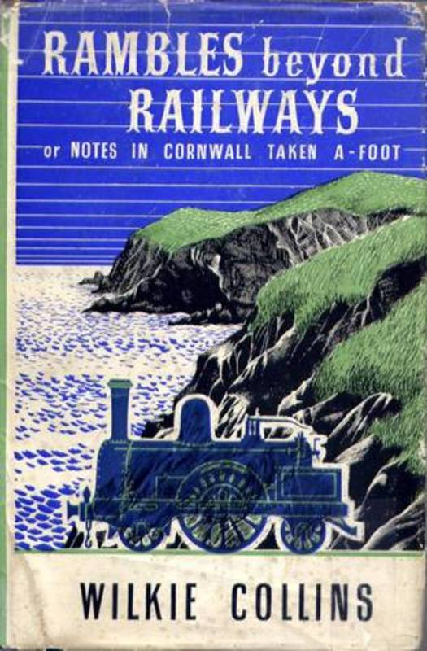
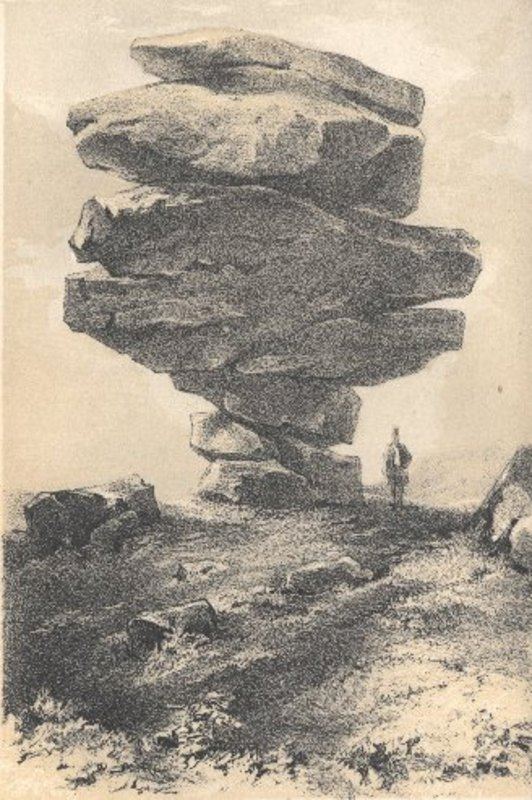
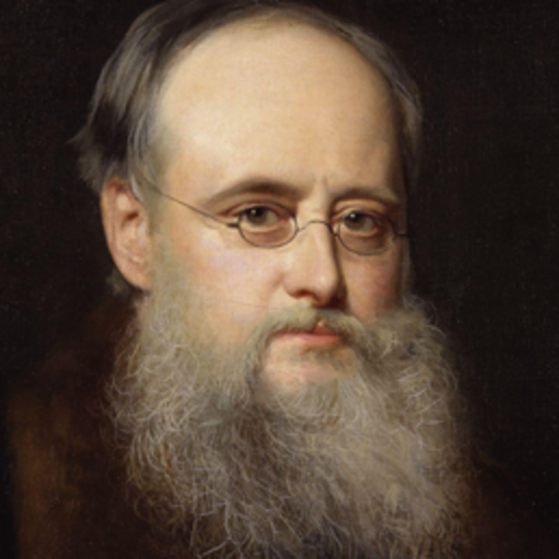

In 1850 the renowned Victorian author [Wilkie Collins](http://en.wikipedia.org/wiki/Wilkie_Collins) visited our area with his artist friend Henry Brandling. In his aptly named book [_Rambles Beyond Railways_](http://www.wilkie-collins.info/books_rambles.htm), for Cornwall was a remote corner of the country and Brunel's railway from England would not cross the river Tamar for another nine years, he describes coming upon the South Caradon Mine:

>  ...still continued to ascend, proceeding along the tram-way leading to the Caradon Mine. Soon the scene presented another abrupt and extraordinary change. We had been walking hitherto amid almost invariable silence and solitude; but now, with each succeeding minute, strange, mingled, unintermitting noises began to grow louder and louder around us. We followed a sharp curve in the tram-way, and immediately found ourselves saluted by an entirely new prospect, and surrounded by an utterly bewildering noise. All about us monstrous wheels were turning slowly; machinery was clanking and groaning in the hoarsest discords; invisible waters were pouring onward with a rushing sound; high above our heads, on skeleton platforms, iron chains clattered fast and fiercely on iron pulleys, and huge steam pumps puffed and gasped, and slowly raised their heavy black beams of wood. Far beneath the embankment on which we stood, men, women and children were breaking and washing ore in a perfect marsh of copper-coloured mud and copper-coloured water. We had penetrated to the very centre of the noise, the bustle, and the population on the surface of a great mine.

The two companions walked on across the open moor coming eventually to the Cheesewring. Collins describes it in his book:

> All the granite we had seen before was as nothing compared with the granite we now looked on. The masses were at one place heaped up in great irregular cairns - at another, scattered confusedly over the ground; poured all along in close, craggy lumps; flung about hither and thither, as if in reckless sport, by the hands of giants. Above the whole rose the weird fantastic form of the Cheese-Wring, the wildest and most wondrous of all the wild and wondrous structures in the rock architecture of the scene.

>  If a man dreamt of a great pile of stones in a nightmare, he would dream of such a pile as the Cheese-Wring. All the heaviest and largest of the seven thick slabs of which it is composed are at the top; all the lightest and smallest at the bottom... When you first see the Cheese-Wring, you instinctively shrink from walking under it.

Collins and his friend admired the views from the summit of the tor and explored the ruins of [Daniel Gumb's](/people/4-daniel-gumb) house which would then have been in its original site. Collins made no mention of the Cheesewring Quarry which would have been in its infancy at that date. The two friends lingered in solitude among the rocks until sunset.

Acknowledgement: 'The Minions Moor' by Peter Stanier

_Rambles beyond the Railways_ is available to [download from Project Gutenberg](http://www.gutenberg.org/ebooks/28367) or [to have sent direct to a Kindle](http://www.amazon.co.uk/Rambles-Beyond-Railways-Cornwall-ebook/dp/B0083ZUJ46/ref=sr_1_1?s=digital-text&ie=UTF8&qid=1356427445&sr=1-1).
