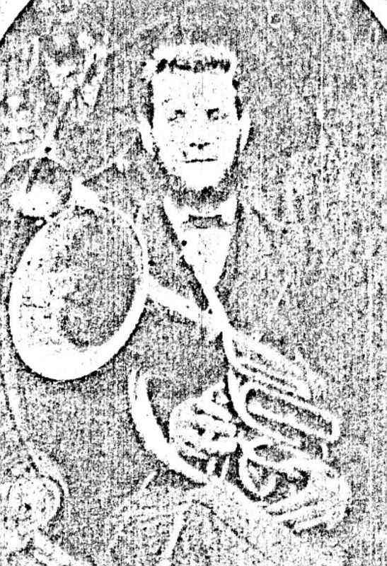

A lady from up-country has provided this photograph in the hope of finding out where the building is today.

It is somewhere in Pensilva and was occupied by one of the lady's ancestors an Emma Smith BROOKS who was born in Callington in 1854. According to census records Emma moved to Pensilva from Woolston between 1861 and 1871. She married John TREGILGAS in 1875 and lived in Pensilva until John's death in 1886.

Emma had 3 young boys and was expecting a fourth child when she moved to Burnley in Lancs to be with her sisters and families who had moved there to work in the coal mines.

A sister of John TREGILGAS married a local farmer, William Rowse, who then became a brother-in-law to Emma.

If anyone knows where these cottages are now (probably well altered and hardly recogniseable) or knows anymore about the families please get in touch with the History Group.

---

The History Group has recently been contacted by Mr. Paul Tregilgas from Hamilton in New Zealand.

Paul is a descendant of Emma Smith Brooks and his great grandfather Eustace Tregilgas was the family member who emigrated to New Zealand.

Eustace Tregilgas was born in Pensilva.

Paul has an extensive website tracking the whole of the Tregilgas family around the world from their beginnings at the Tregilgas farm in St Ewe back in the 1400s. [http://homepages.slingshot.co.nz/~yetiboil/tregilgas/tregilgas.html](http://homepages.slingshot.co.nz/~yetiboil/tregilgas/tregilgas.html)

One page in particular deals with Paul's ancestors in Pensilva. [http://homepages.slingshot.co.nz/~yetiboil/tregilgas/info-johnemmasmithbrooks.html](http://homepages.slingshot.co.nz/~yetiboil/tregilgas/info-johnemmasmithbrooks.html)

COULD THIS BE IT?

Check out the photographs..

The History Group, with the assistance of Paul Tregilgas in New Zealand, think this may be the cottage. It is known that Emma and John lived in Lower Middle Hill in Pensilva. We have looked at several of the cottages down Lower Middle Hill and this one bears quite a resemblance. The upper floor windows come right to the roofline and their spacing, dimensions and distances from each other are very, very similar to the old photograph. The roof has been lowered at some point in time which would account for the different length in the chimneys. The landscape behind the cottage is very similar bearing in mind that something like 134 years has elapsed since the old photograph was taken. What do you think?
