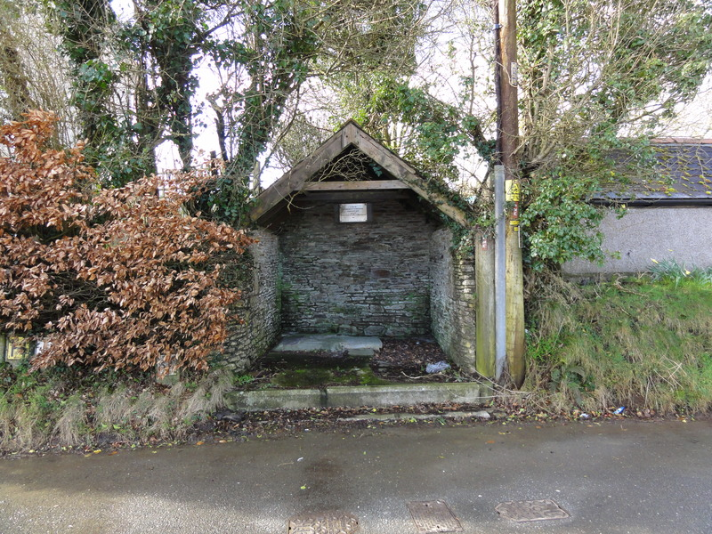

The following article written in 1984 is reproduced by kind permission of Yvonne Gilbert.

Pensilva almost 40 years ago - Going to the Well

Did you ever taste the water from the well in St. Ive Road? On the hottest summer day it was icy cold, and it had a delicious flavour better than any spring water I have ever tasted. When the mains water came, we were told the well water was unfit for human consumption. Yet healthy generations were reared on it. I'd fetch a jug of it for drinking if I could.

We used to carry several buckets of this sparkling wine each day. The pump was painted dark green, and it had a smooth iron handle. The water used to gush out of the spout and splash into the granite trough as my father pumped.

Twice a day we watered the cows at the red brick trough on the opposite side of the road. The cows used to stroll along (there were few cars or motor bikes in those days); my father turned a shiny brass handle above the spout. This diverted the water through a pipe under the road to the trough. He would pump furiously. The cows would drink until they were satisfied, and then continue their leisurely progress to the fields. This was fun in good weather, but, when it rained, we got very wet. There was no picturesque roof in those days.

Over forty households used the pump and its custodian was Mr. M. Body, the Postmaster. He was a tall, distinguished gentleman. He loved cricket and could always tell you the latest test score. One day he came to see me, "Are your mother and father away?" he enquired.
"Yes they've gone to London Airport to collect a friend, but they'll be home tonight"
"No they won't", he said, "the plane's been delayed for twenty four hours. Here's the telegram".

I never forgot his kindness. He bothered to come himself instead of sending the telegram boy. He knew telegrams usually signalled death or injury, and how frightened and worried I should have been before I opened it.

He collected the shilling (5p) per household per year which was paid for the use of the pump and its upkeep. My father paid two shillings (10p) for watering the cattle as well.

Mr. Frank Eva also paid this. He was a wonderful character. When my mother wished the mains water would come he said, "Don't wish for that. You'll have to pay a mint for it". How right he was!
