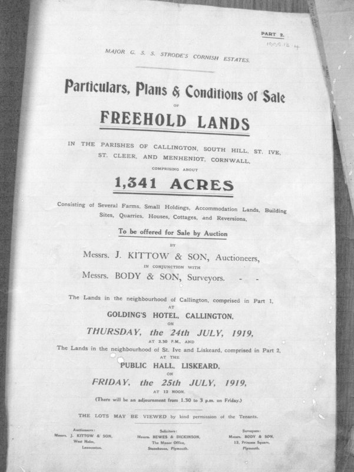
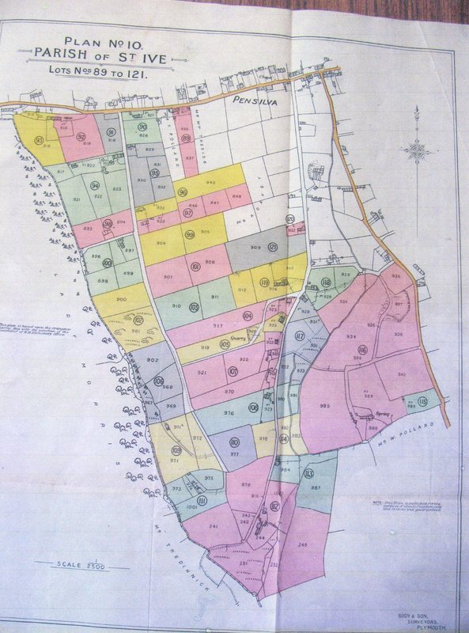
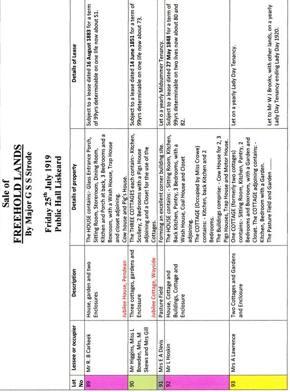
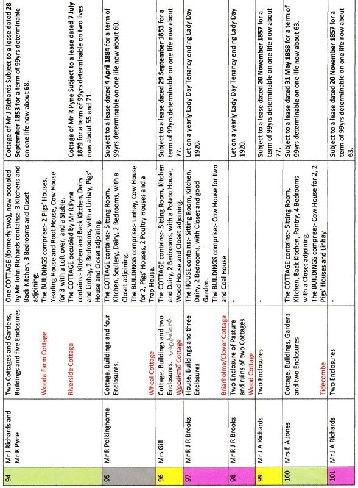
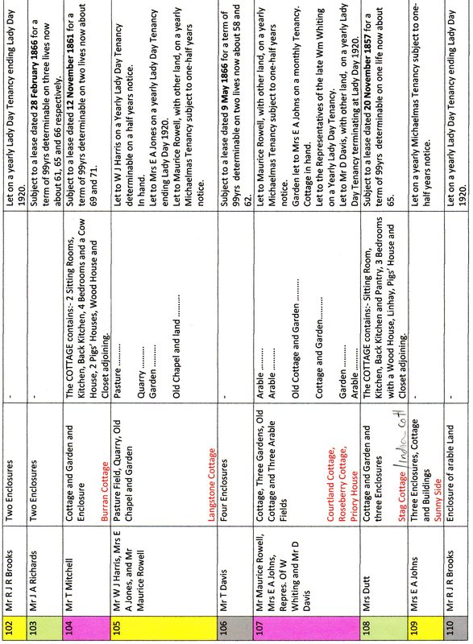
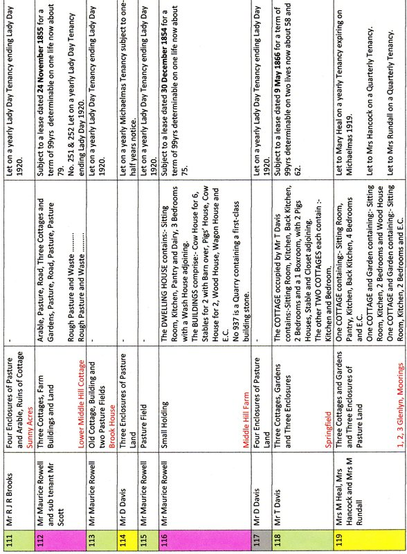
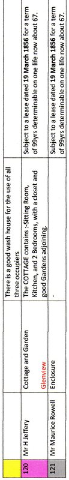
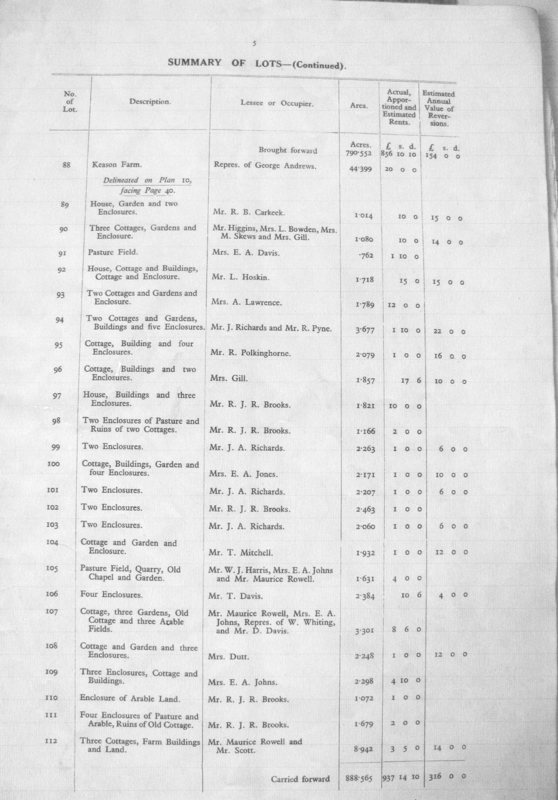
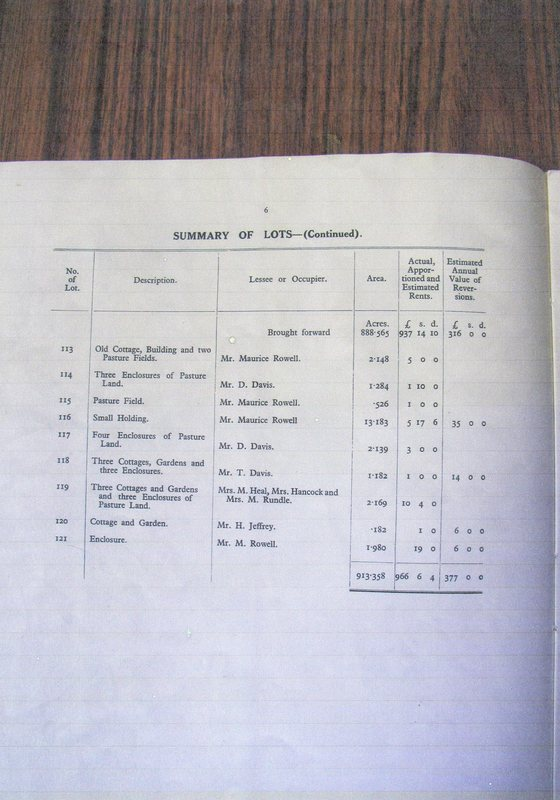

On the 24th July 1919 Major GSS Strode of Newhnam Park, Plympton, Devon sold off by auction his family's holdings of land and buildings in the Middle Hill Area of Pensilva. A detailed catalogue was produced showing the location of all the Lots, a detailed description of them and a Summary of Lots showing the Lessee or Occupier of the Buildings at that time. The Catalogue is reproduced here. The five typed pages showing lot numbers, descriptions and details of lease have been reproduced from the catalogue by Alistair Taylor of the Pensilva History Group. Alistair also discovered the catalogue in Callington Museum and photographed it.

