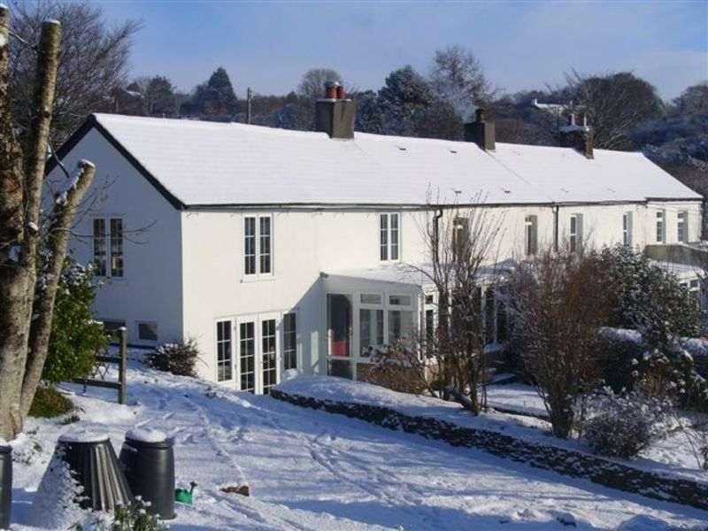
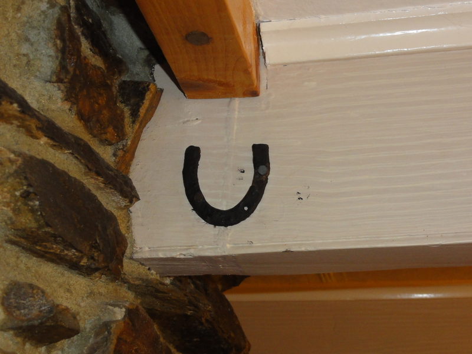
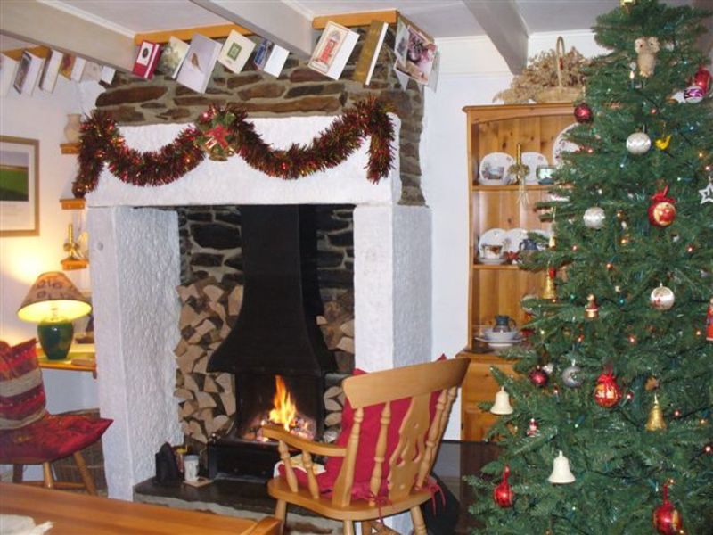

I live in a cottage which is one of a small terrace in Lower Middle Hill, Pensilva. It was built, I believe around 1850 at the start of the mining boom on Caradon Hill but I cannot find out the exact date.

I bought my house on 4th December 1972. It was very small having just a sitting room, small kitchen,
a medium sized bedroom, a small box bedroom with sloping roof and a modern bathroom which had been built onto the end of the cottage. Its walls were thick being made of old fashioned stone and cob and it was a dry and cosy little house. Over the years it got bigger as my family expanded, we tried to make the extensions in keeping with the original house and now, although more than twice as big, it still looks like an attractive Cornish miner's cottage.

The owner before me was Charles Fletcher a shipwright in HM Dockyard Devonport. He inherited the cottage in 1959 on the death of his mother Lucy Parkyn Fletcher.

Lucy Fletcher (wife of the late James Fletcher) bought the cottage on the 1st January 1921 from George Sydney Strode-Strode of Newnham Park, Plympton, Devon, a former Major in the British Army and a Lord High Sheriff of Devon. The Strode family were wealthy landowners who owned land and property in Cornwall and Devon.

Here my house history had ended until a member of the Pensilva History Group came across a set of documents and catalogues concerning the sale of land and property in Middle Hill by the Strode family in 1919. Sure enough the small terrace where I live was part of that sale and the catalogue stated who lived in each cottage in our terrace. Mary Rundle lived in my house.

I quickly visited Liskeard library and looked up the 1901 census on the microfiche. There they were, the people who lived in my house:

- William Rundle Head of Family Age 50 Occupation Arsenic Burner
- Mary Rundle Wife 30
- Annie Rundle Daughter 15 Occupation General Domestic Servant
- William Jnr Son 10 Scholar
- Harold Victor Son 2

I realised that as Mary Rundle was shown as the occupier in Strode's 1919 catalogue then her husband William must have died in the meantime. Perhaps as a result of his occupation. I have since discovered that William died in April 1911 and is buried in Pensilva cemetery, alas no headstone marks his final resting place.

By noting who lived in the neighbouring cottages I was able to discover that the following people lived in my house in 1881:

- John Harvey Head of Family Age 32 Occupation Tin Miner
- Sarah Harvey Wife 37
- Emily Harvey Daughter 17 Occupation Dressmaker
- John Harvey Son 12 Copper Miner
- Flora Harvey Daughter 7 Scholar

It was a surprise to see that young John Harvey at the age of only 12 was a Copper Miner.

The trail has now gone cold. The census of 1871 didn't show the Harveys or any of the neighbours, however, I now know who lived in my house over the last 140 years and that isn't at all bad.

Five years ago I spent a summer renovating a massive granite fireplace that I had found behind a bricked up wall in our old sitting room. It was obviously the original, dirty and smoke stained from constant use for heating and cooking. The hearth was bare earth and in one corner was a pile of chicken feathers. Beneath the feathers I found what appeared to be a small and rusty metal horseshoe, but it wasn't a horseshoe, it had come from the heel or the toe of a working man's boot, probably a miner's. Perhaps it had belonged to John Harvey. It is now fixed to a wooden beam in the ceiling above the fireplace.
