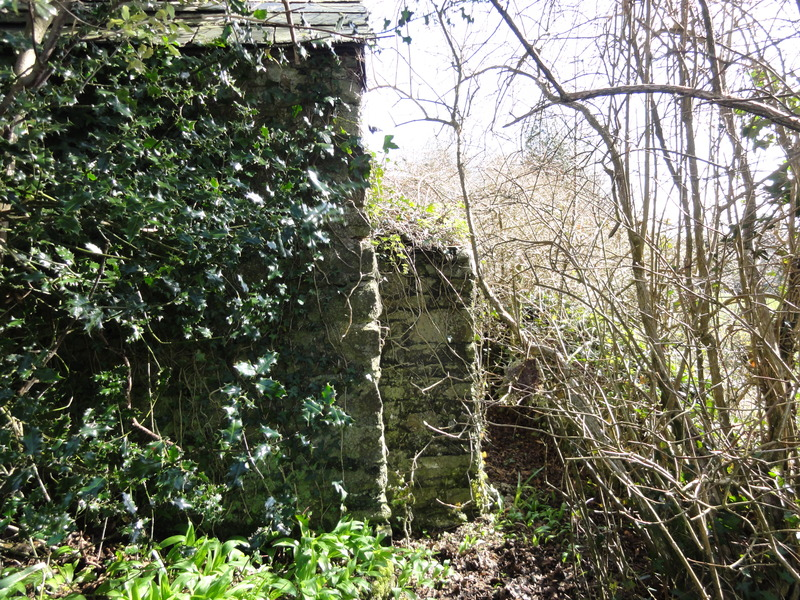

The census of 1841 records only two houses in Pensilva, a farmhouse (now called Jubilee Farm and situated on Jubilee Road) is the older of the two and was occupied by William Jory aged 46, a Farmer by occupation, his wife Martha aged 35, their three sons William, Thomas and Edward and their daughters Martha, Elizabeth and Jane. The other house is shown to be in Middlehill occupied by an agricultural labourer called John Squires, his wife Mary, his two sons George and Samuel, a girl of two years called Emma Harding and John and Mary's baby, Louisa aged 6 months.

The settlement at that time was called Bodminland. It was located on Silva Downs and when given the Cornish prefix 'pen', meaning 'head' or 'higher side' became Pensilva. It remained Bodminland until the late 1800s when the name was changed.

There has always been some form of mining in the area but the full industrial boom started in the early 1840s. A shanty town sprang up around Caradon Hill which was very soon replaced by the building of permanent houses and cottages. Huge numbers of workers from the mines needed accommodation and rows of cottages were built. It is likely the land was cheap and far enough away from the mining activity not to interfere with any possible mining expansion but near enough to easily walk to work.

It is likely that the majority of houses were built by speculative builders who then sold or rented them to the miners or, as in the case of Kleinfontein Terrace in Wesley Road, the mining companies themselves, in this case West Phoenix Mine, built accommodation for their higher status workers. The layout of the village, the grid of streets, plots of land and smallholdings would indicate the hand and eye of estate or land surveyors controlling the overall development. A number of the homes have small stone quarries nearby, the stone probably being used in the building of the houses rather than for commercial use.

The growth rate in Bodminland at this time was extensive with over thirteen rows of cottages, as well as pairs of cottages and detached houses being constructed. By 1881 the population numbered 1360, of these 599 were children. Men over the age of 16 totalled 359 and no less than 271 of them were employed in mining, a further 40 between the ages of 14 and 16 were classified as 'men' and worked in the mines. The expanding population needed services and within a short space of time the school, public house - the Victoria Hotel, three chapels, a Sunday School, parsonage and post office had all been built within the heart of the village. Several of the houses were converted into shops including a grocers, drapers, confectioners, tobacconists, hardware, bootmaker and butchers.

The original single farm had expanded and the census of 1881 records 9 farmers and 10 agricultural workers living in the settlement as well as a mason and carpenter. The cottages built in Middlehill had large gardens and land attached and the miners who lived there used the land as market gardens and kept poultry and livestock.

The census of 1851 records 20 houses in Bodminland and Middlehill, many of the homes had several lodgers, miners from outside the area who needed a place to live. They were not without a sense of humour, one has recorded his name on the census as "A. Bloke".

With the naming of the public house 'The Victoria' and the road leading on from Fore Street being called 'Jubilee Road' it would seem that the majority of the settlement had been developed by the time of Queen Victoria's jubilee in 1862. A large settlement had been created in little more than 10 years. It was described in 1874 (Lake's Parochial History) as 'a comparatively new village chiefly inhabited by miners with a population of 2000'. This was as large as many of the ancient established towns in Cornwall at that time.

The deeds to many of the properties in Middlehill show that they were owned in 1851 by George Sidney Strode and Dorothy Bird Strode of Newnham Park, Plympton, Devon. The Strode family were wealthy landowners and their own home Newnham Park, still stands today. They leased out the land for building and collected the rents. A lease ran for 3 lifetimes and the rent would have been a few shillings per acre. The original documents survive and can be viewed by appointment at the Plymouth and West Devon Records Office. A typical lease reads:

> All that piece or parcel of land part of a Field called or known in the name Middlehill situate in the Parish of Saint Ive in the County of Cornwall and containing by estimation about one Acre and a quarter TOGETHER with the cottage and outhouse erected Thereon.

> To have and to hold the premises hereby demised to the said Tenant for the term of 99 years if Ann Ball now aged about 19 years, Mary Ball now aged about 14 years and Harriet Ball now aged about 1 years or any of them shall so long live.

> An annual rent of 12/6 in equal quarterly payments on Ladyday, Midsummer Day, Michaelmas Day and Christmas Day

The miner's life was hard with the risk of death or chronic lung disease a daily hazard. Bodminland had the reputation of being a lawless place, fights were commonplace. The miners were paid on the second Saturday of the month and the public houses or Taphouses as they were called, were packed and it was a wild night in the mining villages. The area became notorious and a hamlet that had previously been called St Pinnock Highway became known as East Taphouse with West Taphouse a little further down the road.

A Victorian journalist recorded an interview with an old miner in Pensilva, he quoted the old man:

> ...back at the old time there was no 'ouses at the top of Pensilva, Bodminland as it was then, they was down the bottom, two or three lanes go down there and that was Bodminland down there. Lots of miners all down the bottom. You see if one lot came on shift the other ones would go home and go to bed.

By 1895 mining had finished around Caradon Hill. Some granite quarries survived but within a few years they, like the mines, were forced to close because of cheap imports. This downturn in mining all but halted the expansion of Pensilva. The census of 1881 recorded 21 uninhabited houses and only a handful of new ones built. A report of 1892 on the Housing of the Working Classes in the Liskeard Rural Sanitary District described Pensilva as a large mining village with a decreasing population, with dilapidated cottages with limited facilities and poor hygene. The tenants were too poor to pay much rent so therefore the owners were not inclined to do any repairs. An examination of the documents in the Plymouth Records Office shows a large number of requests from tenants in Middlehill requesting repairs to outbuildings such as the pigsty.

The most significant development at that time was the mission church of St John built on the new main road from money left by Archdeacon Reginald Hobhouse of St Ive. Although the village population was in decline there were still three chapels and a Sunday School. Pensilva had the Pensilva Philantrophic Co-operative Society shop situated in Fore Street by 1881. This was perhaps an indication of the hardship being faced by the unemployed miners and the families of the miners left behind when fathers and sons had been forced to travel abroad for work.

By 1905 despite no longer being required to house large numbers of miners the village began to develop, probably due to its convenient location close to Liskeard. Two of the chapels continued in use, while the third on Church Hill was converted to the village hall. A new large school was built in 1914 and the original building converted into Daniel's Garage. The Post Office relocated to Slade Park Road. The Victoria Inn and at least four shops were still trading and a new housing estate was built off Quarry Road. The Old Parsonage was converted to a doctor's surgery.

In 1930 Pensilva was described as ".....a Moorland village.....the inhabitants are chiefly smallholders and farmers, regrators and retired businessmen and army and navy pensioners"

Pensilva expanded hugely during the 1960s as did many other settlements in South East Cornwall after the opening of the Tamar Bridge. Four seperate housing estates were built within the limits of the original village and also to the east and west.

Today only one shop, one church and the Victoria Inn remain. The rest have been converted into houses. The most recent developments have been the Health Centre and Millenium House, both valuable assets to the village.

In 2006 Pensilva and the surrounding Caradon Hill mining area were given World Heritage Status.
