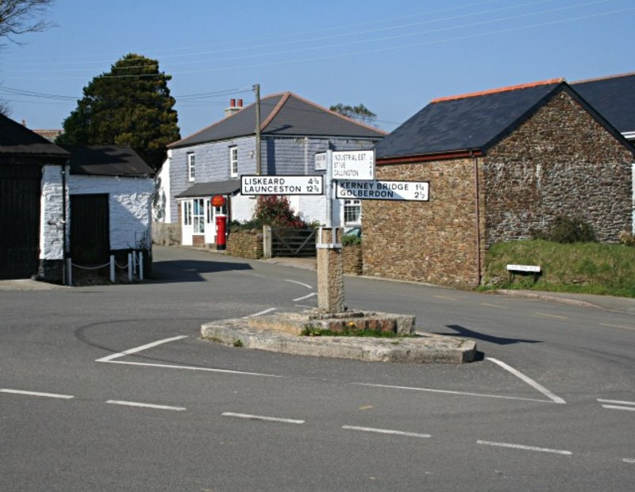

In 2006 Pensilva was given World Heritage status because of its uniqueness as a rapidly expanding Victorian industrial settlement much of which can still be seen today. Much work was done by Cornwall Council and its Historic Environment Service in preparation for the World Heritage status bid and part of this is a detailed, interesting and very readable report entitled the 'Cornwall Industrial Settlements Initiative'. This report can be found online and is essential reading for anyone with an interest in the history of the village and its surroundings. It can be found at: [www.historic-cornwall.org.uk/cisi/pensilva/pensilva.htm](http://www.historic-cornwall.org.uk/cisi/pensilva/pensilva.htm)

The following is an extract from the report:

> Pensilva evolved entirely in response to the industrial activity taking place on the moorland above. There was no development at Pensilva other than a farm until the greatly expanding mine at South Caradon required accommodation to house its workforce, which by 1860 had reached 600 men. Within a few years rows of cottages and smallholdings were erected providing over 250 dwellings, shortly to be followed by shops and small businesses. The essentially temperate nonconformist nature of the mine workers resulted in the building of three chapels but only one public house, which also functioned as a hotel, providing accommodation for visiting speculators, inspectors and adventurers. Beyond this, however, Pensilva is one of the most important industrial settlements in Cornwall because of its morphology. It is an adaption of an extensive settlement pattern of smallholding plots into a relatively tightly defined settlement area. At Pensilva a nucleated centre also developed so that more than most Cornish industrial settlements Pensilva reveals all the settlement patterns and options open to 19th century landowners, industrialists and workers, and gives a unique insight into their possible chronologies.
