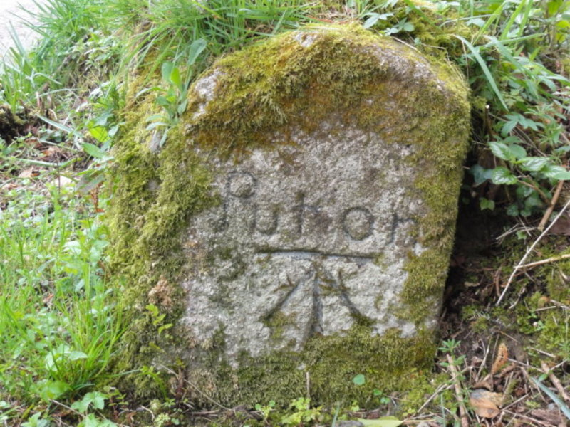
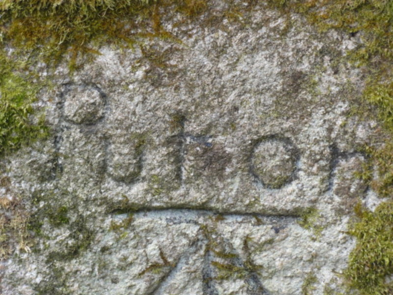
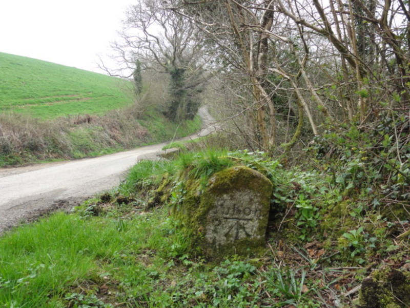
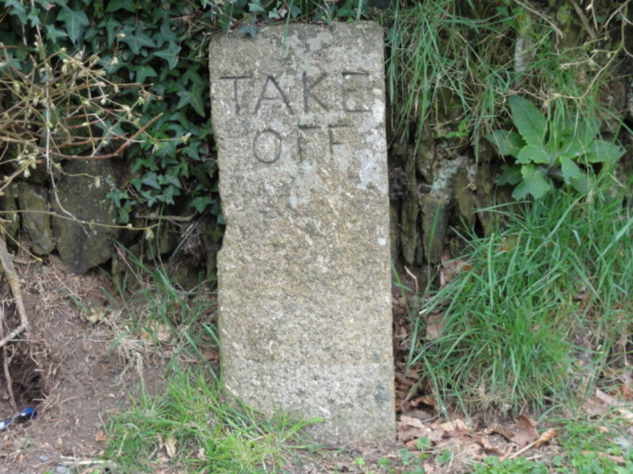
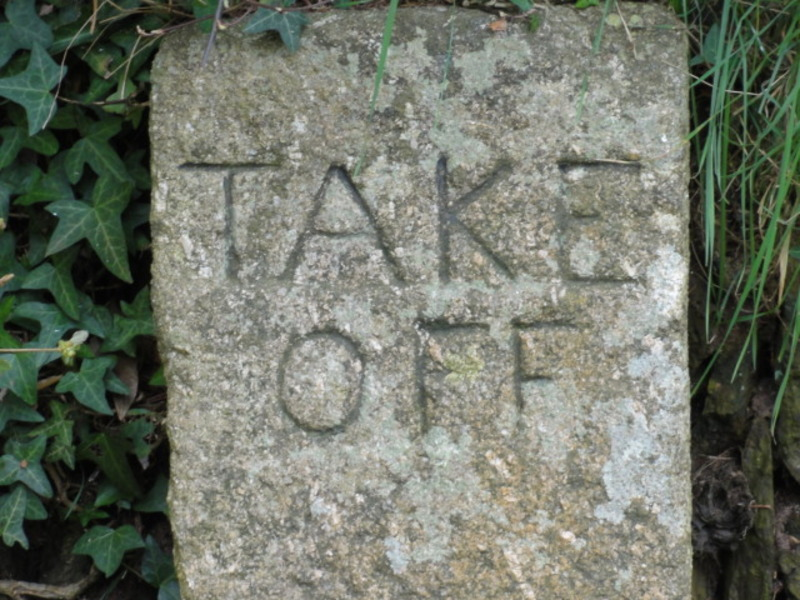

If you drive through the village of St Ive Cross, just before the single-track road begins a long, steady uphill climb, a small granite marker post on the right hand side of the roadway is carved with the words "Put on". The road continues to climb and joins the main A390 towards Callington then turns off to the right towards Cadson Manor and becomes the old single-track roadway again. If you continue on this road just at the entrance to Cadson Manor Farm on the right hand side is another granite marker post bearing the carved words "TAKE OFF".

The posts mark the spot where an extra horse would have been hitched onto a wagon to help haul it up the steady uphill climb and then taken off again when level ground was reached.

There is a lovely old cottage which in older times was two cottages housing two large mining families opposite the "Put on" marker. This cottage is called 'Combegate' which would indicate that it may once have been the site of a Toll Gate.

The single-track road is very old and may in fact be quite ancient, it is possible it may once have been a track leading to Cadsonbury Hill Fort.
