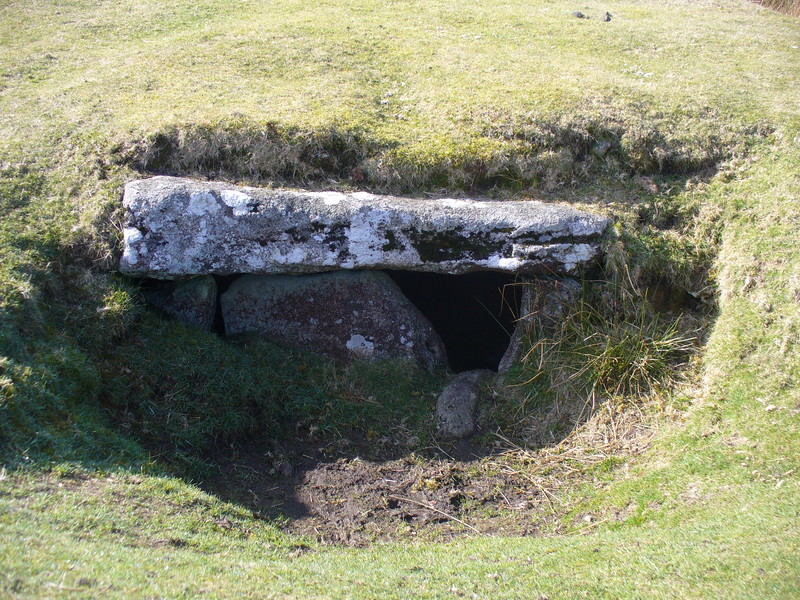

Dating back to the early Bronze Age (c2500-1500BC) the Rillaton Barrow (Grid reference SX260719) is the most famous burial cairn on Bodmin Moor. Prominent on Rillaton Common, it appears to be aligned with the Hurlers, 500m downslope to the SSW. It is a large barrow, perhaps 3 metres high , with a deep depression in the centre. A stone cist exposed at the east end, measuring 1.8m x 1.1m x 0.76m, is a reconstruction of 1901. The barrow was first opened in 1837 by workmen said to be searching for stone to build a mine engine house. John Harris witnessed 'a crowd of half-nude men digging ruthlessly into the old grave barrow.' Finding nothing in the centre, they dug a trench and discovered the cist. Inside were crumbling human bones with a pot. Apparently this was broken by the workmen and the famous gold cup was found within. There was also a metal 'rivet' and the remains of a bronze dagger blade about 25cm long, but this was broken on removal.

Having been sent to King William IV, who died soon afterwards, the Rillaton Gold Cup passed into Queen Victoria's private collection. King George V is said to have used it in his dressing room to hold his collar studs before the cup was finally presented to the [British Museum](http://www.britishmuseum.org/explore/highlights/highlight_objects/pe_prb/t/the_rillaton_gold_cup.aspx) in 1936. A copy is in the Royal Cornwall Museum, Truro.

The Rillaton Gold Cup is 8.25cm high; it has corrugated sides and was beaten from a single lump of gold, with a handle attached by three rivets and washers, top and bottom. The cup is dated to the Early Bronze Age and such rich graves belong to the 'Wessex Culture' - most burials are in southern Britain, so this outlier in the far west is interesting and may be connected to the tin industry. The only other British gold cup of this period, also corrugated, was found at Ringlemere in Kent as recently as 2001. Just a handful of other gold cups are known on the continent.

From 'The Minions Moor' by Peter Stanier - ISBN 978 0 948385 43 X
