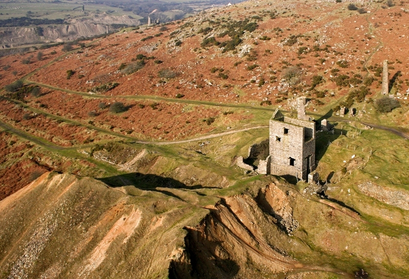
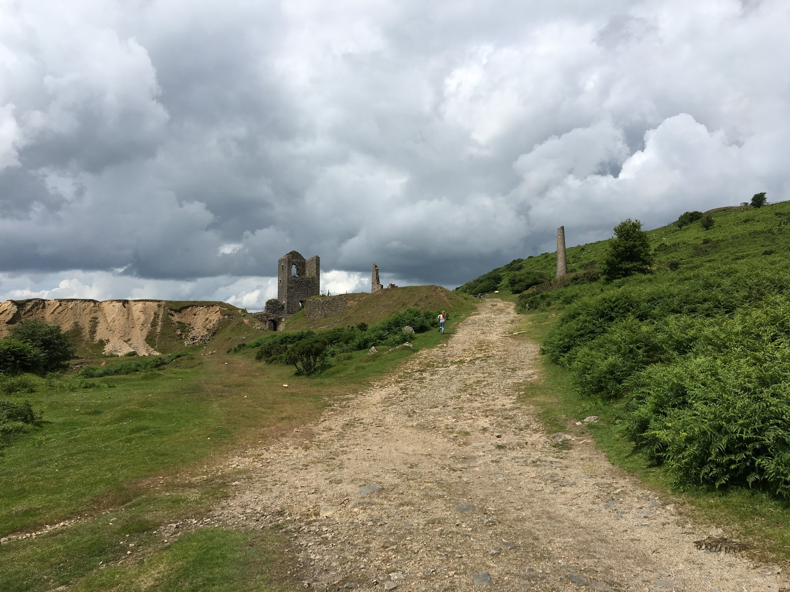
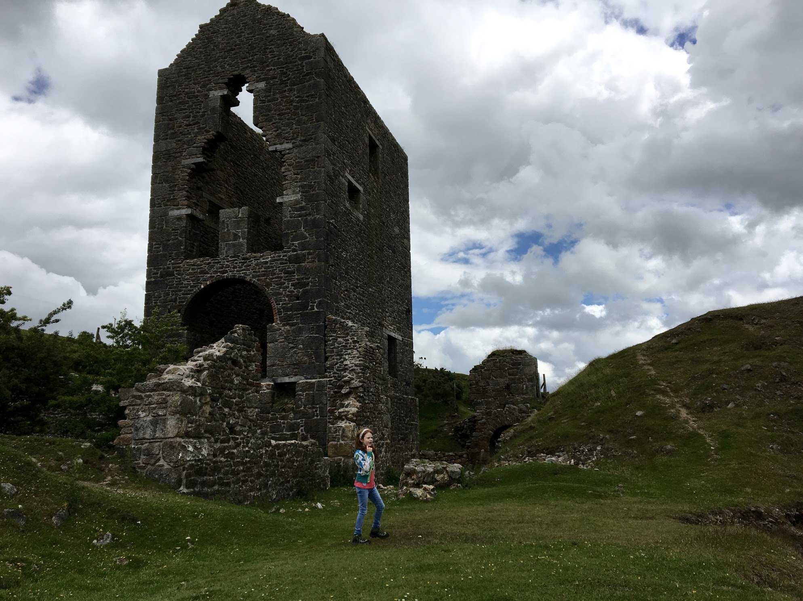

South Caradon Mine lies about half a mile from the summit of Caradon Hill, on its southern slopes and in the Caradon Mining District of East Cornwall. The mine was one of the major copper producing mines in Cornwall with a total output of 217,820 tons of copper ore. It lies in sixth posiition behind Dolcoath (241,522 tons) and Carn Brea Mines (237,500 tons). The sett is bounded by Gonamena Mine to the north, West Rosedown and East Caradon to the north and east and West Caradon to the west. We are grateful to John Manley whose excellent [South Caradon Mine](http://teammanley.webs.com/SouthCaradon/Index.html) website provided us with a great deal of information about the area.

