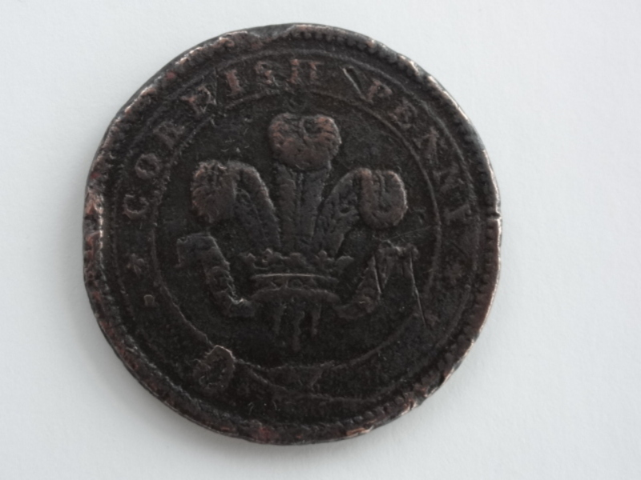
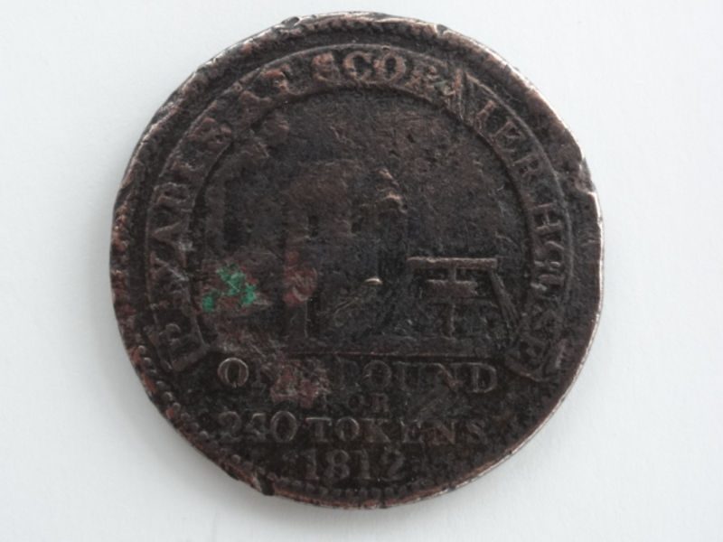

Cornish currency has been issued in various forms since medieval times and possibly earlier. One early story tells that the Cornish people raised the money by popular subscription to pay a ransom for the release of the Duke of Cornwall, Richard the Lionheart, during the Crusades. The 15 Gold Bezants on the arms of the Duke of Cornwall are said to represent the money raised.

Another early reference to the Cornish currency, the 'dyner', is found in a 13th century Cornish play in the line "dhodh a dela pymp cans dyner", which translates as "he was owed five hundred dyner". The only English coin at the time was the silver penny: presumably the dyner was equivalent to this.

The earliest known Cornish mint was at Launceston (originally at St Stephen near Launceston), which operated on a minimal scale (before Cornwall received full diocesan jurisdiction in the year 994 AD) at the time of Ethelred II in 976. A royalist mint was established in Truro in 1642-43 during the English Civil War by Sir Richard Vyvyan. In September 1643 it was moved to Exeter.

Several Cornish towns in the mining districts set up their own Banks and even issued their own banknotes. One example is 'The Mounts Bay Commercial Bank' which was set up in 1807 by the Bolitho family of Penzance. The 'Consolidated Bank of Cornwall' was taken over by Barclays Bank in 1905. In 2004 a rare banknote from the Falmouth bank sold for £540. Several other examples of Cornish banknotes are held at the Country Museum in Truro.

#### Cornish Tokens

Cornish tokens, sometimes called Cornish Pennies, were trade tokens widely used in the 18th and 19th century in Cornwall.

One dated 1811 had the words "For the accommodation of the county". In the centre was a pilchard between cakes of copper and ingots of tin. On the other side were the words 'Cornish penny' and in the centre a view of a mine, pumping engine and winding gear.

Cornish pennies issued by John Williams of Scorrier House (see photographs above) are also found: one dated 1812 has on the obverse the badge of the Prince of Wales (three plumes) and on the reverse a view of a mine pumping engine and winding gear and the words "Payable at Scorrier House/ One pound for 240 tokens"

The Cornish penny shown above was found in the grounds of Trebeigh Manor near St Ive by Peter Gilbard.
