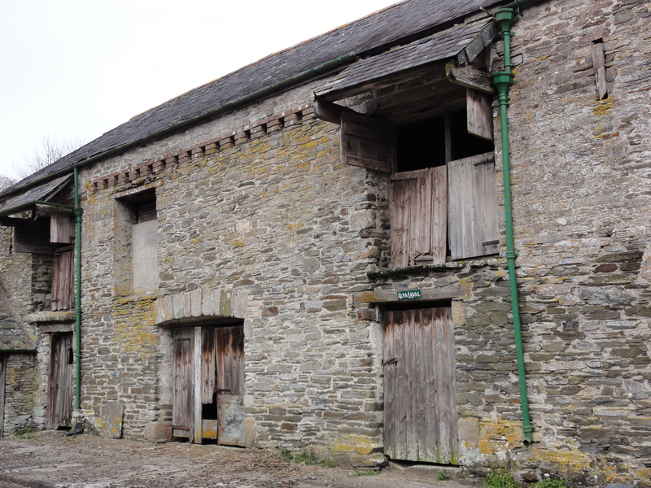
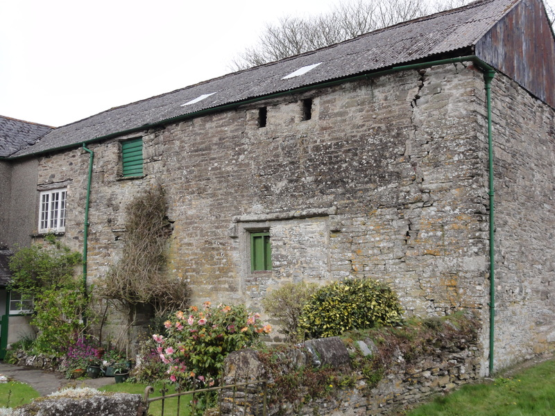
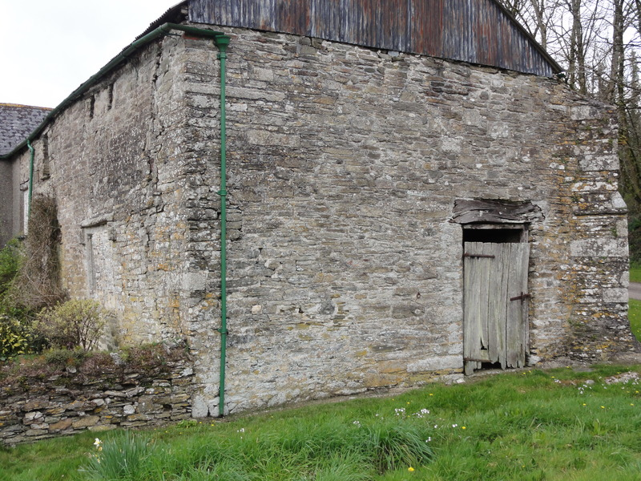
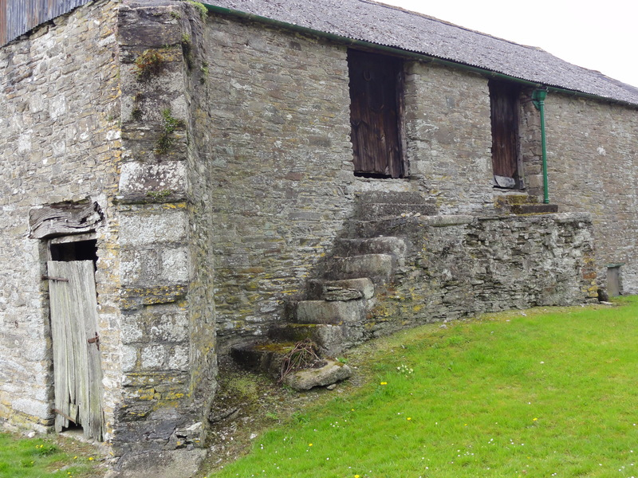
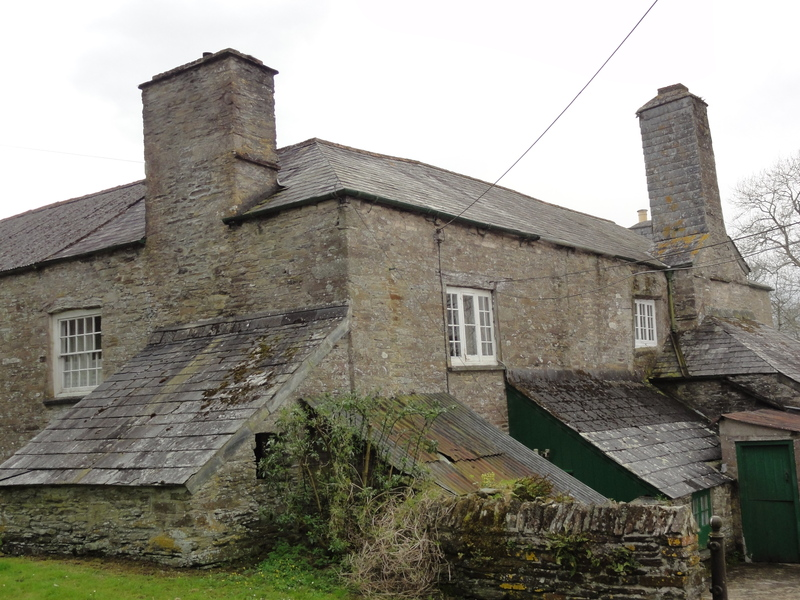
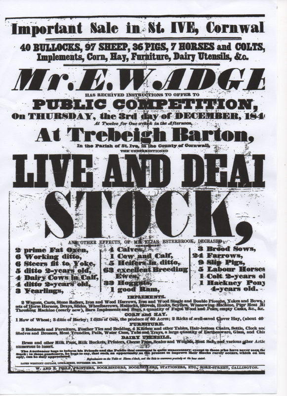

At the time of the Norman Conquest there was a farm in South East Cornwall with the Cornish name of "Trebighan", meaning 'Little Farm'. This farm was part of the estates of the Abbot of Tavistock and the tenant farmer was Oswulf.

After William, Duke of Normandy, was crowned on Christmas Day 1066 he took all the land and distributed it amongst his own Norman knights. Trebighan was given to his half brother Robert, Count of Mortain.

The entry in the Domesday Book for Trebighan reads:

'The land of the Count of Mortain.
Oswulf held it before 1066, and paid tax for 1 ferling; 1/2 hide there, however. Land for 2 ploughs, 3 smallholders. Pasture 200 acres. Value formerly 20s. value now 5s.'

Under the ownership of the Count we read that Trebighan became almost like a royal palace, with a courtfleet, a steward, a bailiff and a prison. It had the right to try small offences and punish for debts and damages.

Then Robert of Mortain died, the new owner was King Stephen, who on his death left it to King Henry II. King Henry gave the manor of Trebighan, which by now had come to be called 'Trebigh' to the Knight's Templars in 1150.

For more than 150 years the Templars lived their quiet, orderly lives in the monastry at Trebigh and then came trouble. Stories and accusations were invented to bring about their downfall. Even in St Ive, Giles, the rector appointed by the Templars, was involved in a scandal and had to leave. His successor was the first rector to be appointed by "The Prior to the Holy House of the Hospital of St John of Jerusalem in England", to whom was now given all Templar properties including Trebigh. It became the centre for the administration of all the estates in Cornwall.

The monastic life continued peacefully at Trebigh, pilgrims on their way to the Holy Land would find refuge and refreshment before they reached St. Michael's Mount which was the point of departure from Cornwall.

Shortly after this the Order became short of men. Many had been lost as a result of the Black Death and the shortage was felt all over England. Trebigh became united with Anstey in Wiltshire under Robert Botyll, the only Preceptor to rise to any prominence in the Order. In 1440 he became Grand Prior of England and as such was a trusted advisor to Henry VI.

When Henry VIII confiscated all the Templar lands the estates had been leased to Sir John Chamond and John Welsh, so the fact of the dissolution made very little difference to the tenants. Sir John remained until his lease expired and was followed by Robert Gardyner who had leased the estate from Edward VI at an annual rent of £48.

Queen Mary returned Trebigh to the Templars but Queen Elizabeth I finally abolished the Order and assigned th estate by 'Letters Patent to Henry Welbye and George Blythe' and to their heirs forever. From them it passed to Henry Killigrew of Wolston whose daughter brought it by marriage to John Wrey. The manor became their residence and much of the old Preceptory was pulled down to make way for a new mansion to be built on the site. So it was in 1584 when John Norden wrote his "Descriptions of Cornwall". His entry reads:

"Trebigh, the house and manor of William Wraye, priviledged with a large fraunchise"

The Wrey family made Trebigh their home for about a hundred years. Then the heir married a young lady of the wealthy Bouchier family and they moved to her home at Tawstock near Barnstaple. The status of Trebeigh declined to that of a farm and was let to a succession of tenants for nearly 300 years. It was in 1960 that the farm was purchased by members of the Gillbard family from Sir Bouchier Wrey. These were the third generation of that family to have farmed it as tenants.

The farm house still has a buttressed wall on the south east corner. The lintel of carved granite on the north west wall has designs resembling Maltese Crosses which have become weathered by time. The head of the front staircase is adorned with huge figured granite and the dog tooth pattern at the base suggests the Early English style of architecture. The windows at the front and back are Tudor design and the chimney wall hides a Tudor fireplace. This was uncovered in 1982 and revealed a hearth of enormous proportions complete with cloam oven and iron chimney bar. Upstairs is a small chamber, still with beams and plaster, hidden in a wall.

There are stories and traditions handed down - one that Church Park, the field immediately below the Church, must never be ploughed. Another says that a secret tunnel links Trebeigh to the Church. Locally Trebeigh is known as Trebeth, in the Cornish language this means 'the farm with a grave', thus giving credence to the story that Church Park is an old burial ground.

Trebeigh lies sheltering in a valley with an abundant supply of water and surrounded by woods. It will outlive many newer properties, that's for sure, but its future will never match its past.

